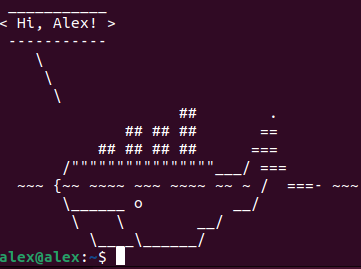

# Установка и настройка Docker

Первое требование - это определиться с физической или виртуальной машиной, где будет стоять докер.

На этой машине тебе понадобиться подходящая ОС, в моем случае я поставлю Убунту 18.04 на виртульную машину от
виртуалбокса, зупущенную поверх Виндовс 7.

Таким образом, я буду выполнять установку Docker на Убунту.

Я буду устанавливать на Windows 11.

[Ubuntu 22.04.2 LTS](https://ubuntu.com/download/desktop)

[VirtualBox 7.0.6](https://www.virtualbox.org/wiki/Downloads)

Идем на страницу с документацией

[docker docs](https://docs.docker.com/)

В раздел download and install.

В этом разделе размещены подробные мануалы о том, как поставить докер комьюнити едишн на разные платформы.

Все что касается ентерпрайз едишн теперь в ведении мирантис после того, как они купили команду кодер интерпрайз.

Таким образом докер (неразборчиво "бот"?) бесплатный для нас, но не всегда. Со второго ноября 2020г появились
ограничения для бесплтного размещения своих образов. Посмотри тарифные планы, если хочешь узнать больше.

Тем временем я выбрал свою платформу, у меня это Линукс. Промотал до Убунту 64 бита.

Предварительные требования гласят, что на 18.04 можно установить докер.

Я перейду в свой терминал и командой

```bash
cat /etc/*rel*
```

На момент 16.03.2022 установка докера отличается от установки на видео.

Стоит всегда следовать актуальному флоу с официальной документации

[docker docs](https://docs.docker.com/desktop/install/ubuntu/)

Установка завершена, давай что-нибудь запустим.

Переходим на сайт

[hub.docker](https://hub.docker.com/)

На нем ты найдешь много известных и популярных докерезированных продуктов, таких как nginx, mongodb и др.

Я ищу образ приложения whalesay, копирую команду

```bash
sudo docker run docker/whalesay cowsay Hi, Alex!
```

С этой командой докер в репозиторий, скачает нужный образ и запустит его на хосте с указанными мной параметрами, а
именно приветствием Hi, Alex!

Хочу напомнить, что в этом курсе тебе не обязательно устанавливать и настраивать свое ПО, как я говорил в лекции, мы
предоставим тебе возможность практиковаться прямо из браузера в рамках наших лабораторных.

Также у тебя всегда будет возможность практиковаться в песочнице, о который я тоже рассказывал в лекции.

Но я буду только рад, если ты повторишь мои шаги и попрактикуешься - это пойдет только на пользу.

А тем временем кит сказал "Hi, Alex!", замечательно! У нас все получилось (:


