# Обзор команд

## Команды

В этой лекции мы поговорим и посмотрим на команды.

1. Начнем с команды docker run

```docker
docker run
```

Как ты помнишь, образ - это шаблон приложения и его зависимостей собранных вместе.
А контейнер - это экземпляр образа.

docker run - используется для запуска контейнера из образа.

```docker
docker run nginx
```

Команда docker run nginx запустит экземпляр приложения nginx на твоем докер-хосте, если этот образ уже присутствует
локально. Если его нет на хосте, то докер "сходит за ним" в докерхаб и спулит этот образ себе. Это потребуется сделать
всего 1 раз. При следующих запусках этого контейнера докер будет использовать локальный образ.

2. Ты можешь посмотреть список запущенных контейнеров и основную информацию о них (о имени контейнера, его айди, статуса
   образа) с помощью команды docker ps

```docker
docker ps
```

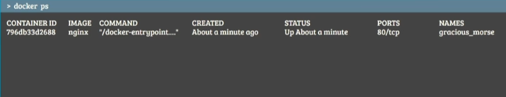

Каждый контейнер получает случайным образом выбранный ID и случайное имя, если оно не было указано явно при создании.

Весь список контейнеров, и запущенных и нет, показывает команда docker ps -a

```docker
docker ps -a
```

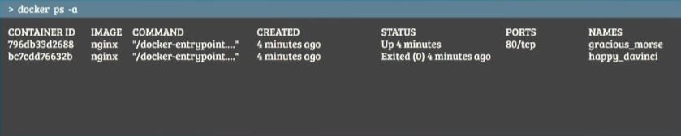

Как ты видишь, в системе 2 контейнера.
Контейнер №1 работает, а №2 - нет.

3. Как остановить работающий контейнер?

Используй docker stop вместе с id контейнера или его именем.

```docker
docker stop
```

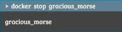

Если ты не уверен в имени или id лучше для начала вызови docker ps


Еще раз резюмируем:

+ docker ps - это запущенные контейнеры
+ docker ps -a - это все, которые есть на хосте (работающие и нет)

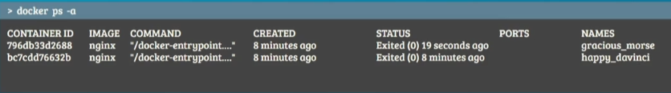

Контейнер gracious_morse был создан для разовой работы. Он свою задачу выполнил, завершился и будущем мне уже не
понадобится. Теперь он просто занимает место на диске.

4. Чтобы избавиться от ненужных контейнеров используй docker rm

```docker
docker rm
```

Эта команда полностью удаляет остановленные (stopped) или завершенные (exited) контейнеры.
В случае успеха она вернет имя или id контейнера.

```docker
docker rm gracious_morse
```

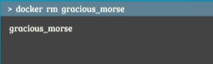

Для проверки запустим docker ps и посмотримверно ли все удалилось.

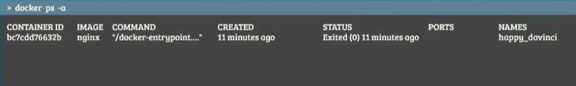

Как видишь, его больше нет в нашей системе.

5. А что со сканенным образом nginx, который докер скачал в начале?

Он нам тоже не нужен. Мы не собираемся его больше использовать, нужно удалить этот образ. Но для начала давай посмотрим
на список образов, представленных на нашем докер-хосте.

Комадна docker images покажет все доступные на хосте образы, их id, теги и размер.

```docker
docker images
```

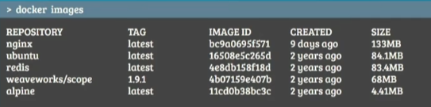

У нас представленно 5 образов локально: nginx, ubuntu, redis, weaveworks/scope, alpine.
Чуть позже я расскажу про теги.

6. А сейчас сфокусируемся на удалении образов.

Запустим команду

```docker
docker rmi
```

Помни!
Перед тем как удалить образ тебе нужно убедиться, что контейнеры от этого образа не запущенны в системе.
Тебе нужно остановить и удалить все зависимые от этого образа контейнеры прежде чем удалять сам образ.

```docker
docker rmi redis
```

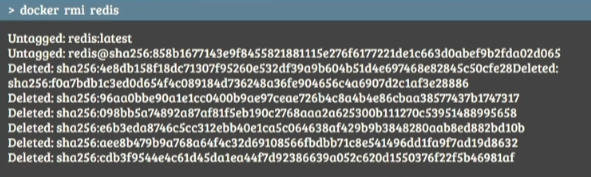

7. Ранее я запустил команду docker run и она скачала образ redis, поскольку не нашла его локально на хосте. А что, если
   мы просто хотим скачать образ и сохранить? Например для того, чтобы потом быстро запустить redis не ожидая пока его
   образ запуллиться из репозитория.

В этом нам поможет команда docker pull

```docker
docker pull redis
```

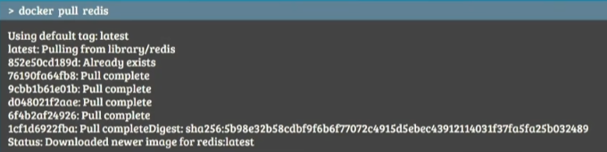

Которая просто скачает образ, но не будет его запускать.

Как видишь, найдя локально image, docker run не идет за ним в репозиторий.

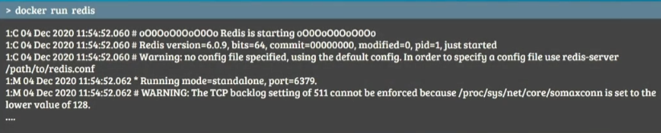

## Особенности контейнеров

Если мы запустим контейнер из образа Ubuntu при помощи команды

```docker
docker run ubuntu
```

Это запустит экземпляр ubuntu и немедленно выйдет из него.

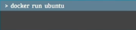

При просмотре работающих контейнеров мы не его не увидим

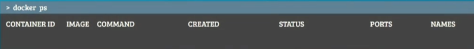

Но если посмотреть всписок всех контейнеров, находящихся на хосте, включая остановленные, обнаружатся контейнеры с
состоянием exited

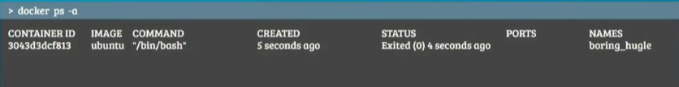

Это еще одно отличие от виртуальной машины, - контейнеры не предназначены для размещения операционных систем.

Цель контейнера - выполнить работу и перестать потреблять ресурсы.

Задания вроде анализа данных, расчета каких-то значений, размещения экземпляра БД или веб-сервера, - эти процессы хорошо
подходят для контейнера.

Как только задача завершается, т.е. основной процесс внутри контейнера завершается, контейнер останавливается.
Становится exited.

Получается, что контейнер живой, пока жив процесс с которым запускался контейнер.

Это важно.

Если веб-сервер или БД внутри контейнера скрашится или остановится, контейнер немедленно выйдет. Поэтому запустившийся
контейнер с образом ubuntu моментально остановился. Потому что сама ОС является площадкой для запуска процессов. У нее
не было процесса по умолчанию. Того огонька что поддерживало бы жизни контейнера.

Тем не менее возможность запустить такой контейнер есть.

Если в образе не запущено какое-либо приложение, как в случае с ubuntu, мы можем попросить докер запустить процесс с
помощью команды docker run.

Например команду сна с продолжительность 5 секунд:

```docker
docker run ubuntu sleep 5
```

При запуске контейнера в нем запуститься команда sleep, которая будет работать 5 секунд.

Она и будет тем процессом в контейнере, ради которого он живет. Когда команда завершится, контейнер будет остановлен. А
мы увидим на экране результат выполненной команды.

## Выполнить команду в контейнере

Ок, мы научились запускать команду вместе с контейнером. А как сделать так, чтобы выполнить команду на работающем
контейнере?

Например, у меня выполняется контейнер с ubuntu. Когда я делаю docker ps -a, то вижу его статус Up.


Внутри него выполняется команда sleep 500. Я хочу увидеть содержимое файла внутри контейнера. Как мне это сделать?

Используем docker exec для выполнения команд на работающем контейнере:

```docker
docker exec clever_morse cat /etc/hosts
```

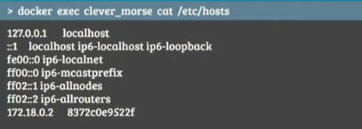

В данном случае, я вывел содержимое файла /etc/hosts, - это файла контейнера, а не ОС докер хоста.

Если просто написать

```bash
cat /etc/hosts
```

То вывод будет другим, поскольку я обращусь к хостовой ОС, а не к контейнеру.

## Attach and detach

Перед тем как перейти к практике, давай посмотрим еще на один момент.

Для обучения у нас есть простое веб-приложение, его код есть на моем гитхабе, если тебе интересно.

Его собранный образ лежит на докерхаб в rotorocloud/webapp - это приложение запускает небольшой веб-сервер, который
доступен на порту 5000.

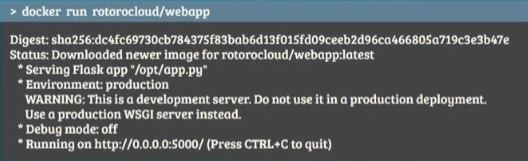

После запуска команды

```docker
docker run rotorocloud/webapp
```

Приложение может быть развернуто в фоне или прикреплено к твоей консоли.
Последнее значит, что стандартный output контейнера будет перенаправлен на твой терминал и ты будешь видеть весь вывод
процесса веб-сервера на своем экране.

Ты не сможешь никак взаимодействовать с консолью, пока она прикреплена к приложению, до тех пор пока контейнер не
остановится.

Для принудительной остановки использую комбинаюцию ctrl+c, - это остановит контейнер, приложение перестанет выполняться
и ты попадешь обратно в приглошение своей ОС.

Есть другой способ запустить докер-контейнер, использую detached mode.

```docker
docker run -d rotorocloud/webapp
```

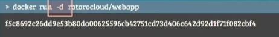

Пишется как деш-ди. Это запустит контейнер в фоновом режиме и ты сразу же сможешь взаимодействовать со своей оболочкой.

Контейнер продолжит свое выполнение. Чтобы проверить это ты можешь запустить docker ps

В любой момент ты можешь прикрепить контейнер к консоли запустив команду docker attach с указанием id или имени
контейнера

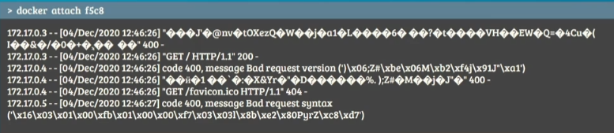

Обрати внимание, что при использовании id, не обязательно писать длинную строку id. Достаточно указать первые несколько
символов. Однако, если на хосте в данный момент есть дублирование первых символов каких-то id, то тебе придется указать
больше символов. Например, пять или более. Чтобы докер однозначно понимал о каком id идет речь.

В данный момент нам не интересна работа самого веб-сервера, нас интересует как запустить контейнер и как это выглядит из
консоли.

К работе приложения мы еще вернемся в следующих лекциях.
