# Demo commands

Привет, и добро пожаловать на лекцию в которой мы подробнее рассмотрим особенности команды
`docker run`. Это одна из наиболее часто используемых команд и у нее, наверное, больше всего
параметров для запуска. Этот ряд особенностей тебе необходимо будет знать и уметь применять
на практике, если ты хочешь, чтобы Docker облегчил твою жизнь. Мы попрактикуем это на
лабораторной.

Идем на сайт [docker hub](https://hub.docker.com/search?q=)

Смотрим, какие контейнеры нам доступны.

Попробуем alpine linux [alpine](https://hub.docker.com/_/alpine)

Запустим его командой

```docker
docker run alpine
```

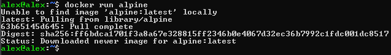

Если будет указано только имя образа, докер будет думать следующим образом:

+ репозиторий по умолчанию докерхаб
+ если не указано имя пользователя, то нужно искать в библиотеке официальных образов

При запуске неофициального образа используется формат: имя_пользователя/имя_образа.

Используем параметр `-it` для входа внутрь контейнера.
`sh` - оболочка shell.

```docker
docker run -it alpine sh
```

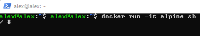

```shell
hostname
```

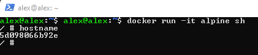

Давай посмотрим на релизную информацию этой ОС

```shell
cat /etc/*rel*
```

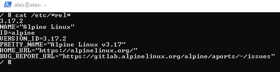

Посмотрим на список работающий контейнеров

```docker
docker ps
```

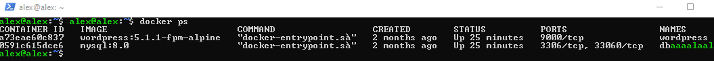

Запустим контейнер в фоновом режиме `-d` , чтобы открепить от него консоль и займем контейнер выполнением
процесса `sleep`

```docker
docker run -d alpine sleep 15
```

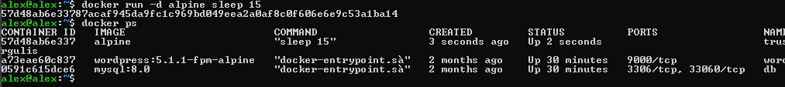

Тебе потребуется команда, чтобы увидить все контейнеры, которые присутствуют у тебя на хосте.
Как работающие, так и уже выполненные/остановленные.

```docker
docker ps -a
```

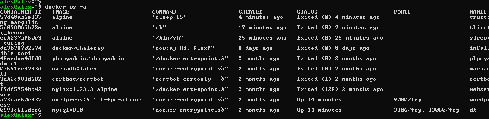

Запустим alpine в detached mode на 1000 секунд

```docker
docker run -d alpine sleep 1000
```

Чтобы прервать работу контейнера ("Убить контейнер")

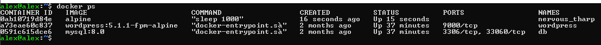

`docker stop (Имя или id)`

```docker
docker stop nervous_tharp
```

Как удалять контейнеры

`docker rm (Имя или id)`

```docker
docker rm
```

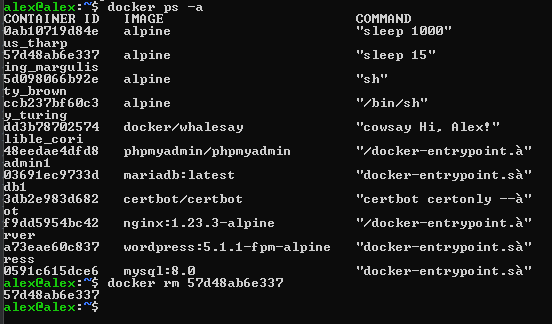

Теперь переходим к образам

```docker
docker images
```

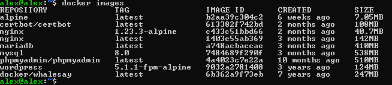

Для удаления контейнеров есть команда

```docker
docker rmi alpine
```


Для тестов нам потребуется образ busybox

```docker
docker run -d busybox sleep 200
```

Попробуем удалить образ пока работает контейнер

```docker
docker rmi busybox
```

```shell
Error response from daemon: conflict: unable to remove repository reference "busybox" (must force)
```

Остановим контейнер.
Удалим образ командой для удаления множества контейнеров/образов.

```docker
docker rm $(docker ps -aq)
```

Удалит все контейнеры.

Чтобы скачать образ заранее, в докер есть команда:

```docker
docker pull nginx
```

Команда скачает докер образ на хост не запуская.

Запустим его в фоновом режиме

```docker
docker run -d nginx
```

Чтобы посмотреть конфигурацию nginx внутри контейнера.

Для начала определем id контейнера командой `docker ps`

Чтобы выполнить команду в работающем контейнере введем `docker exec id_контейнера`

```docker
docker exec c9c0e88d78f8 cat /etc/nginx/nginx.conf
```

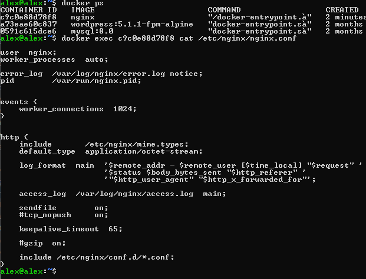

Помогают в решении пролем команды `docker inspect` `cocker logs`
