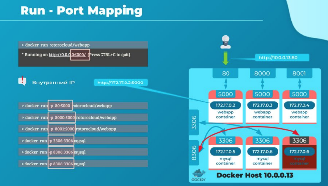
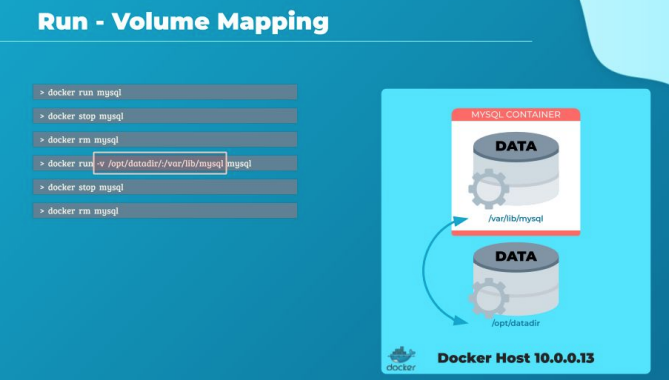
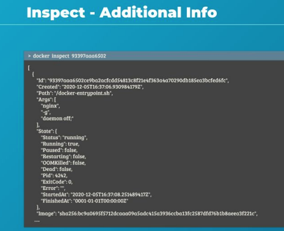
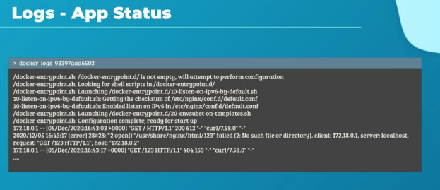

# Особенности команды docker run

Привет, и добро пожаловать на лекцию в которой мы подробнее рассмотрим особенности команды
`docker run`. Это одна из наиболее часто используемых команд и у нее, наверное, больше всего
параметров для запуска. Этот ряд особенностей тебе необходимо будет знать и уметь применять
на практике, если ты хочешь, чтобы Docker облегчил твою жизнь. Мы попрактикуем это на
лабораторной.

Ок, мы уже умеем запускать контейнеризированный Redis командой `docker run redis`.
В этом случае запустился Redis версии 6.0.9. Но что если мне нужна другая версия? Скажем, я хочу
запустить Redis версии 5.0.

Для этого надо указать версию через разделитель - (:) двоеточие после имени образа. Это
называется tag. В этом случае Docker скачает образ Redis версии 5.0 и запустит его.
Обрати внимание, если ты не указал тег, то Docker будет искать образ с тегом "latest". Тег latest
обычно связывают с последней версией этого ПО и за его установку ответственны создатели
продукта. Но как нам, как пользователям, найти информацию какие версии доступны у приложения
и какая из них последняя?

Поискать на https://hub.docker.com/. Найдем имя образа redis и список применимых к нему тегов, а
также описания каждой версии для соответствующего тега. Каждая версия может иметь
несколько коротких и длинных тегов, ссылающихся на нее. Как видишь версия 6.0.9 также еще и
имеет тег latest.

Теперь давай поговорим о вводе. Для пояснения у меня есть маленькое приложение, оно доступно
на докерхабе, если захочешь запустить. Итак, на первом шаге у меня был простой шелл-скрипт,
который при запуске спрашивал имя, а после ввода писал на экране приветствие и те данные,
которые ему передали при вводе.


Я произведу некоторые манипуляции, о которых поговорим чуть позже, и сделаю из этого скрипта
докеризированное приложение. При его запуске таким образом: `docker run rotorocloud/prompt-docker` мы не получим
приглашение к вводу. Приложение напишет только то,
что жестко прописано в скрипте, т.к. оно не получило никаких данных. Это произошло потому, что
по умолчанию докер-контейнеры не слушают стандартный ввод. Даже с присоединенной консолью
он не сможет прочитать введенные тобой данные. У него нет терминала для чтения ввода, он
работает в неинтерактивном режиме.

Давай добавим возможность ввода, подключив терминал, откуда мы эти данные введем.
Чтобы это сделать используй параметр -t (-t означает использование псевдотерминала). В этот раз
приложение сразу не вышло. Я получил приглашение на ввод данных, но что-то идет не так - когда
пытаюсь ввести имя и нажать ввод ничего не происходит. Не работают даже клавиши,
останавливающие приложение. Что же произошло?

ОС внутри контейнера видит мой терминал, а команда, выполняющаяся в данный момент ждет с
него данные. Проблема в том, что мы не связали стандартный ввод (stdin) своего хоста с stdin
контейнера. И контейнер изолирован в части получения данных из стандартного ввода. Команда
останется в вечной петле ожидания, пока мы не убьем контейнер.

Чтобы контейнер стал принимать данные на свой стандартный ввод с терминала или какого-либо
pipe используй параметр -i. Параметр -i включает интерактивный режим, и когда мы вводим свои
данные, они успешно поступают на ввод нашего контейнера. Теперь мы можем ввести данные с
клавиатуры, а команда их получит, и мы увидим ожидаемый вывод.
Итак, комбинация -it дала нам возможность подключится и взаимодействовать с контейнером в
интерактивном режиме. Хочешь подключиться к контейнеру - будь из IT, легко запомнить :)

Параметр -it нужен для непосредственного подключения человека, потому что терминал дает
возможность контейнеру получить некоторые управляющие команды, а также обеспечивает
дополнительные возможности вывода на консоль пользователя. В случае с автоматизацией
обычно достаточно -i.

Вот случай автоматического pipe, команда:

```docker
echo "Rotoro" | docker run -i rotorocloud/simple-prompt-docker
```

Команда echo и контейнер в пайпе сами договорятся без всяких терминалов



Самое время разобраться с публикацией портов или как их еще называют пробросом портов в
контейнер. Давай вернемся к примеру с нашим веб-сервером на 5000 порту, с которым мы
познакомились в предыдущей главе. Запустим его на нашем докер-хосте. Как ты помнишь, хост, на
который установлен Docker в части запуска контейнеров, называется Docker host или Docker engine.

Когда мы запускаем контейнеризированное веб-приложение, оно начинает работать, и мы видим,
что сервер запустился. Но как нам дать доступ пользователям к этому приложению?

Как видишь, мое приложение слушает на порту 5000, я могу получить доступ через этот порт. Но
какой IP мне использовать в своем браузере?

Тут есть два варианта.

Первый использовать IP докер-контейнера, т.к. у каждого контейнер есть свой собственный адрес,
каждый докер-контейнер получает IP присвоенный по умолчанию. В данном случае 172.17.0.2. Но
помни, что этот адрес внутренний и будет доступным только внутри докер-хоста, где контейнер
выполняется. В общем, если ты запустишь на своем докер-хосте браузер, введешь в нем
http://172.17.0.2:5000 и получишь доступ. Но пользоваться этим сервисом смогут только
внутренние пользователи этого хоста. Т.к. это внутренний IP внешние пользователи не смогут
использовать этот URL.

Для внешних запросов мы могли бы использовать IP, по которому внешние пользователи ходят на
наш хост, 10.0.0.13 в нашем случае. Но для того, чтобы это заработало, мы должны сопоставить
порт внутри контейнера со свободным портом на докер-хосте. Допустим, я хочу, чтобы
пользователи получили доступ к моему приложению на порту 80 нашего докер-хоста. Тогда мне
нужно сопоставить порт 80 localhost с портом 5000 в контейнере Docker.

Для этого используй параметр -p в команде `docker run`. И пользователи смогут получить доступ к
приложению по URL http://10.0.0.13:80. Весь трафик, полученный на этот порт 80 будет
маршрутизирован на порт 5000 внутри контейнера. Таким манером ты можешь запускать много
экземпляров разных приложений и сопоставлять их различным портам на докер-хосте.

Например, я развернул экземпляр mysql, который запустил БД и начал слушать на дефолтном порту
mysql 3306. Также я запустил еще один инстанс базы, смаппив его порт 3306 на порт 8306 хоста.
Итак, ты можешь запустить столько приложений, сколько тебе нужно и пробросить столько
портов, сколько тебе требуется. Разумеется есть ограничение в том, что ты не можешь назначить
один порт докер-хоста несколько раз.

Мы еще вернемся к пробросу портов и сетевом взаимодействии в лекции о сетях в Docker. А сейчас
давай познакомимся с тем, как нам хранить постоянные данные при использовании контейнеров.



Допустим у нас запущен контейнер с mysql. Когда базы и таблицы будут созданы, физически они
будут сохранены по по пути /var/lib/mysql в докер-контейнере. Запомни, что контейнер имеет свою
собственную изолированную файловую систему и любые изменения происходят только в ней, они
не имеют отношения к файловой системе хоста. Теперь мы зальем большой дамп данных в эту
базу. Что произойдет если мы удалим этот mysql-контейнер?

Как только произойдет удаление, мы потеряем все данные. Это связано со слоистой структурой
контейнеров, о чем мы поговорим позже в этом курсе. Как же хранить постоянные данные в
контейнерах?

С помощью специальной директории, размещенной на докер-хосте, данные в которой не будут
относится непосредственно к контейнеру, а будут подключены как бы извне. Как будто внешний
жесткий диск. Нам потребуется связать две директории: одну на хосте, а вторую в контейнере. В
этом случае я создал директорию /opt/datadir и пробросил ее в контейнер по размещению
/var/lib/mysql.

Для создания связи используется параметр -v, а далее пишется путь до директории на хосте, потом
двоеточие-разделитель и папка внутри контейнера. Сначала откуда - с хоста, потом куда - в
контейнер. Легко запомнить.

Таким образом, при запуске докер-контейнер неявно монтирует внешнюю директорию в свою
внутреннюю. Теперь все данные спокойно лежат во внешнем томе в директории /opt/datadir
докер-хоста и не зависят от жизни контейнера. Они останутся там, даже если контейнер будет
удален.



Команда `docker ps` хорошо подходит для быстрого сбора основные деталей о контейнерах в нашей
системе. Таких как имена, ID и т.д. Но периодически нам будет требоваться развернутая
информация о каком-то контейнере. В подобных случаях нас выручит команда `docker inspect`, она
запускается с именем или ID контейнера.

Она вернет нам детальную картину этого контейнера в JSON формате. Его состояние, что
смонтировано, как сконфигурировано, настройка сети и т.д. Не забудь про нее, когда тебе нужно
будет узнать детали запущенного и забытого кем-то контейнера или в похожей задаче.



И наконец траблешутинг. Когда что-то идет не так, мы смотрим логи. Как их смотреть в
контейнерах?

С помощью команды `docker logs`. Чтобы посмотреть эту команду давай запустим наше
веб-приложение в фоновом режиме используя параметр -d.
`docker run -d rotorocloud/webapp` запустит его в detached mode.

Теперь запустим команду `docker logs`, а дальше имя контейнера или его ID. Мы видим журнал,
сформированный из stdout того контейнера.

В мире разработки контейниризированных приложений часто практикуется не хранить логи в
файлах, а передавать информацию на стандартный вывод, где ее собирает агент мониторинга. Об
этом мы подробно говорим в курсе разработчика приложений для Kubernetes.

> docker run имя:версия - запустить контейнер нужной версии
> 
> docker run -it имя команда - запустить контейнер и вывести вывод в терминал
> 
> -i - связать стандартный ввод хоста со стандартным вводом контейнера
> 
> -t - связать стандартный вывод хоста со стандартным выводом контейнера
> 
> echo 'qwe' | docker run -i имя - передать на ввод контейнеру строку qwe
> 
> docker run -p 80:5000 имя - сопоставить порт 80 хоста порту 5000 в контейнере
> 
> docker run -v /opt/datadir/:/var/lib/mysql имя - смонтировать каталог /opt/datadir/ хоста в каталог /var/lib/mysql в
> контейнере
> 
> docker inspect имя - детальная информация о контейнере
> 
> docker logs имя - вывести стандартный вывод контейнера


