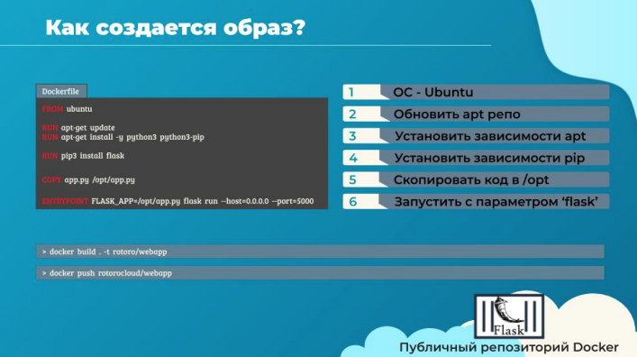
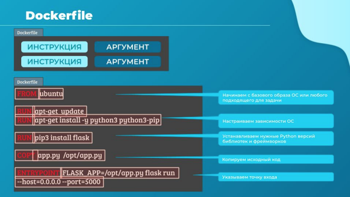
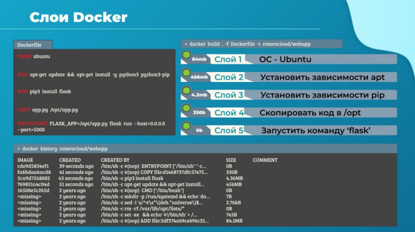
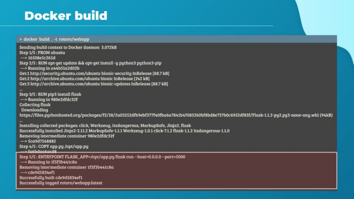
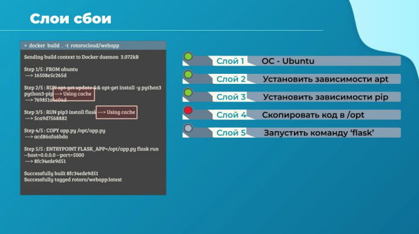

# Образы докер

Итак, мы решили создать свой собственный образ. Но для начала давай определимся зачем мы это
делаем, зачем нам свой образ?

Возможно мы не можем найти какой-то компонент или службу для своего приложения. Или мы
хотим контейнеризировать свое приложение для обеспечения простоты тестирования, доставки и
развертывания. А быть может мы собрали несколько уникальных окружений для компиляции
исполняемых файлов и используем это в своих CICD-конвейерах. Перечислять можно много, важно,
что нам не обойтись готовым решением из публичных репозиториев.

В этом случае я собираюсь контейнеризировать свое простое веб-приложение. Оно написано на
python с фреймворком flask. Вначале нужно понять, что мы положим в контейнер или с каким
приложением мы собираемся создавать образ.

Давай поразмышляем, как бы это было, если бы мы развёртывали это приложение вручную.
Записав требуемые шаги в правильном порядке мы создадим план для создания нашего простого
приложения.

Итак, для начала в ручном режиме я бы установил себе операционную систему, например ubuntu.
Далее я бы обновил apt-репозитории используя `apt update`. После этого с помощью `apt install
python` установил бы python с соответствующими зависимостями и утилитами. Затем с помощью
`pip install flask` создал бы необходимый для этого фреймворка базис. Осталось скопировать мой
исходный код в нужную папку, например /opt/. Последний шаг - запустить код нашего веб-сервера,
используя специфичную для flask команду. Ок, теперь с помощью этих инструкций мы запросто
создадим свой первый Dockerfile.

Вот краткий обзор процесса создания собственного docker-image:
создай файл с именем Dockerfile и запиши туда инструкции по настройке своего приложения, такие
как установка зависимостей, место, куда копировать исходный код приложения, какая точка входа
будет использована и т.д. После этого, создай свой образ при помощи команды `docker build`,
указав Dockerfile и теги для образа. Это создаст локальный докер-образ в твоей системе.

Чтобы сделать его доступным в публичном докер-репозитории, вроде Docker Hub используй
команду `docker push` command с указанием имени только что созданного образа. В этом случае
команда будет содержать имя моего аккаунта на Docker hub - rotorocloud, а дальше имя образа -
webapp.

Давай познакомимся поближе с этим Dockerfile. Он пишется в специальном формате, который
понятен Docker и состоит из инструкций и аргументов.

Все, что в Dockerfile написано слева заглавными буквами будет считаться инструкцией. Я выделил
эти места красным цветом текста. В нашем случае это: FROM, RUN, COPY, ENTRYPOINT. Все они
являются инструкциями. Каждая из них указывает Docker выполнить определенное действие в
процессе создания образа.

Все, что правее инструкций - это аргументы. Т.е. в первой строке FROM - инструкция, а Ubuntu -
аргумент.

Наша первая строка определяет, какая базовая ОС будет использоваться для строительства образа
и запуска контейнера из него в дальнейшем. Каждый докер-образ базируется на подобном
базовом image. Т.е. на образе ОС или другом образе, который был создан на основе образа ОС.
Официальные релизы популярных ОС размещены на Docker Hub, ты их сможешь легко найти для
своих экспериментов. Еще раз отмечу, что все Dockerfiles начинаются с инструкции FROM, не
забывай об этом.

Инструкция RUN дает указание Docker запустить данные тобой команды на этом базовом образе.
Мы видим, что Docker запустил команду apt-get для получения обновленных пакетов и установки их
на наш базовый "голый" образ Ubuntu. Такой же инструкцией RUN он запустил команду pip install,
тем самым установив зависимости для python. Напомню, что все действия производятся в
изоляции и к нашей хостовой ОС отношения не имеют.

После завершения инструкций RUN, инструкция COPY копирует файлы из директории нашей
локальной ОС в этот собирающийся образ. В этом случае исходный код нашего python-приложения
находится в папке, из которой мы запустили команду `docker build` и мы скопируем его в
расположение /opt внутри образа Docker.

И, наконец, последняя здесь инструкция ENTRYPOINT. Она позволяет нам указать команду, которая
сработает, когда образ будет запущен в качестве контейнера.

Когда Docker создает образы они строятся по слоеной (layered) архитектуре. Каждая новая
инструкция создает новый слой в докер-образе, который хранит в себе отличия от предыдущего
слоя.

Например, за первым слоем базовой ОС Ubuntu следует инструкция, которая создаст второй слой, в
котором будет установлены apt-пакеты, за ним последует третий слой, который создаст третья
команда, установившая пакеты python. Четвертый слой скопирует исходный код и последний
пятый слой обновит точку входа этого образа.

Поскольку каждый слой хранит только изменения предыдущего слоя, это значительно отражается
на размере. Взгляни, базовый образ Ubuntu имеет размер в районе 84mb. Apt установит нужные нам
пакеты - это еще около 456mb. Оставшиеся слои еще меньше. Ты можешь посмотреть
информацию о слоях с помощью команды `docker history` указав имя образа, который создавал.

Во время сборки образа команда `docker build` выводит все шаги, которые она делает, какие
команды запускает и их результат. Все слои кэшируются, поэтому слоеная архитектура помогает
тебе как в случае ошибок при сборке, так и при проведении повторной сборки образа. Тебе не
нужно начинать все сначала - Docker перестроит только те слои, в которые были внесены
изменения.

У каждого слоя есть свой хеш, по которому Docker отслеживает их уникальность

Например, при сборке на четвертом шаге произошел сбой. Мы разобрались и уточнили причину
сбоя. Теперь мы перезапустим сборку и увидим, что старые три слоя были переиспользованы из
кэша, а фактическое исполнение команд Docker начал только с четвертого шага.

Тоже самое будет, если ты изменишь одну из команд - низлежащие под ней слои (т.е. слои,
которые были выполнены до этой инструкции) не будут затронуты, но будет перестроен слой
измененной команды и все слои после нее. Эти новые слои также добавятся в общий кэш докера.
Это позволяет создавать образы быстрее, тебе не нужно ждать команды, которые уже до этого
были выполнены.

Это очень полезно при обновлении исходного кода приложения. Обычно исходный код в
контейнере подвергается изменению гораздо чаще, чем библиотеки и зависимости, поэтому
копирование файлов приложения находится обычно в конце Dockerfile

Мы уже видели ряд продуктов, содержащихся в контейнерах, таких как операционные системы,
системы управления базами данных и т. д. Но это еще не все. Ты можешь создавать
контейнеризированные версии практически любых приложений от серверных высоконагруженных
до клиентских повседневных. Контейнерные версии бизнес-приложений тоже уже очень
популярны. Это могут быть большие приложения или простые утилиты, главное, чтобы решение в
контейнере было удобнее в использовании, чем классическое с инсталляцией.

Также большое удобство здесь в том, что тебе сразу может быть доступно несколько версий
одного приложения, обычно несовместимых в одной "песочнице". Второе удобство, что контейнер
после себя не оставляет столько мусора, как в случае с простой установкой приложения и от него
очень просто избавиться.

Это все в этой лекции, увидимся в следующей!

> Новые команды docker:
> docker build . -t имя - собрать образ из dockerfile в каталоге .
> docker push имя - загрузить образ в репозиторий
> docker history имя - информация о слоях образа

> Работа с dockerfile:
> FROM - образ на базе которого создается новый образ контейнера
> RUN - запустить команду на указанном образе
> COPY app.py /opt/app.py - скопировать файл app.py в образ в каталог /opt/app.py
> ENTRYPOINT - процесс запускаемый в контейнере
