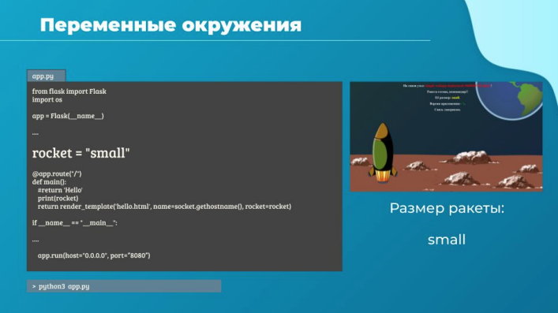
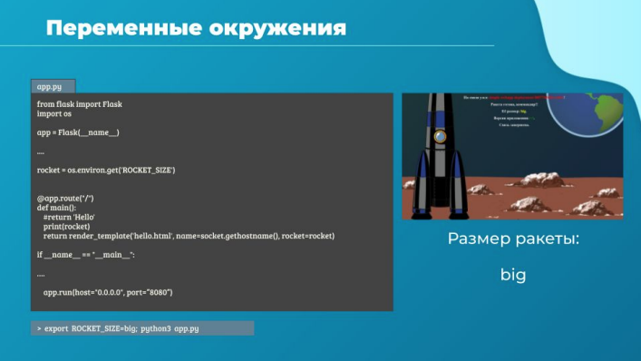
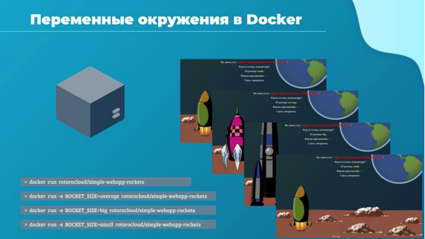
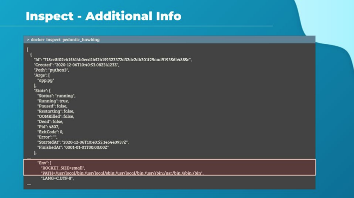

# Привет, в этой лекции мы поговорим о переменных окружения.



Начнем с нашего простого приложения, показывающее ракеты. Оно написано на python. Взгляни на
этот участок кода. Он создает веб-сервер, который демонстрирует веб-страницу с ракетой. Если ты
посмотришь внимательно, ты найдешь строку, которая определяет размер ракеты как small.

В данный момент все это работает прекрасно. Однако, если ты решишь изменить размер ракеты в
будущем, то придется менять код приложения. Лучшая практика в таком случае вынести
информацию из кода приложения в переменную окружения с именем ROCKET_SIZE.



Внесем изменения в код. Теперь при запуске приложения установим переменную окружения
ROCKET_SIZE в желаемое значение при помощи команды `export ROCKET_SIZE=big; python3 app.py` и
запустим приложение. Как видишь такой подход может избавить нас от сборки отдельного билда
приложения под каждый размер ракеты.



Пересоберем образ и запустим: `docker run rotorocloud/simple-webapp-rockets`

Приложение покажет нам ракету размера small. Совсем не то, что ожидали. Это потому, что мы
назначили переменную окружения в нашей хостовой среде, но внутри контейнера ее не существует.
Для того, чтобы установить эту переменную в контейнере используй параметр -e при запуске.
В нашем случае: `docker run -e ROCKET_SIZE=big rotorocloud/simple-webapp-rockets`
С этой опцией ты можешь запустить много одинаковых контейнеров, которые будут
демонстрировать разные ракеты. Просто назначь разные переменные окружения этим
контейнерам при старте.



Как узнать, какие переменные существуют в уже запущенном контейнере и какие у них значения?

С помощью команды `docker inspect`. Эта команда показывает развернутую информацию о
работающем контейнере, в том числе в секции config ты найдешь список всех переменных
окружения этого контейнера.

Это все в этой короткой лекции, переходим к практике.

установить переменную окружения внутри контейнера
```docker
docker run -e
```
