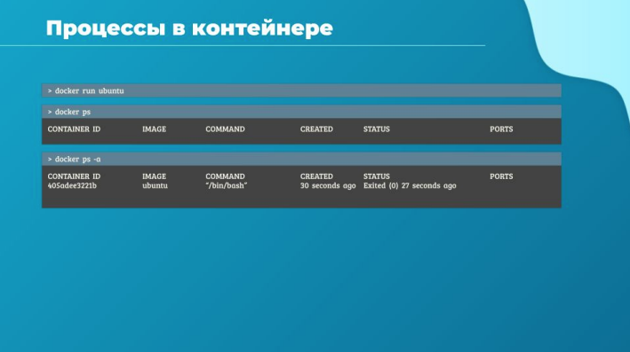
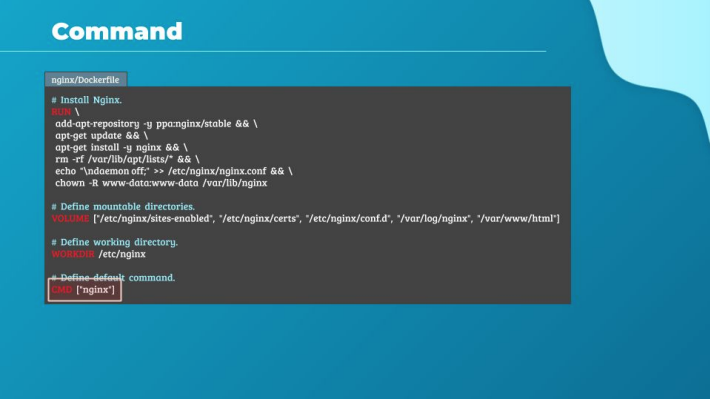
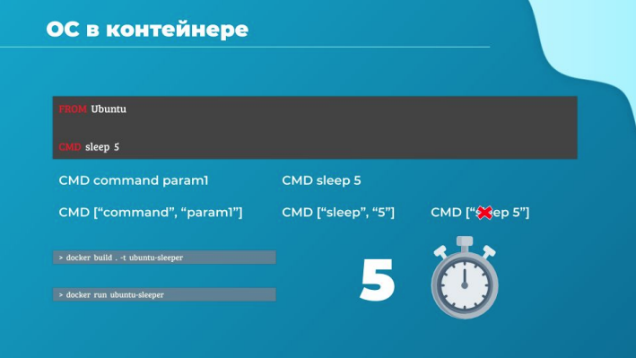
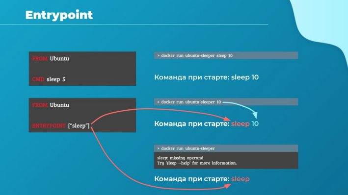
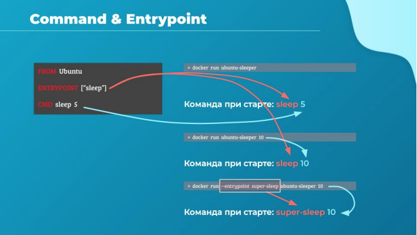

# Привет и добро пожаловать на лекцию, где мы поговорим о аргументах команд и точках входа в Docker.

Начнем с простого сценария. Предположим, что мы запустили контейнер с образом ubuntu. Когда
мы ввели команду `docker run ubuntu`, Docker запустил экземпляр образа ubuntu и немедленно
сделал выход из контейнера.

Если сейчас посмотреть список работающих контейнеров, то мы не увидим их. Если же запустить
`docker ps -a`, тем самым запросив список всех контейнеров на хосте, мы увидим наш новый
контейнер, он будет остановлен со статусом exited. Почему это не работает как виртуальная
машина?

Как мы уже говорили, контейнеры не предназначены для размещения операционных систем.

Они подходят для некоторых процессов вроде запуска веб-сервера, базы данных или
аналитической задачи. Когда задача завершена, контейнер останавливается. Жизнь в нем
поддерживает работающий внутри процесс. Т.е. если веб-сервер, или база данных, или другой
запущенный процесс внутри контейнера остановится или скрашится, то контейнер немедленно
выйдет. Итак, что определяет, какой процесс будет запущен в контейнере?

Если посмотреть на Dockerfile такого популярного приложения как nginx ты увидишь инструкцию
CMD. Эта инструкция определяет команду, которая будет запускаться в контейнере при запуске
его из образа. Это команда nginx. Для официального образа MySQL в Dockerfile будет команда
mysqld.

Ранее мы пытались запустить контейнер с пустой ОС Ubuntu. Посмотрим на Dockerfile этого образа
и мы увидим, что команда по умолчанию там bash. Но как мы знаем bash это не совсем такой
процесс, вроде веб-сервера или базы данных. Это оболочка, которая ждет ввода с терминала и,
если если она не может найти терминал, она завершается. Когда мы запускали контейнер с Ubuntu
ранее, Docker создавал контейнер из образа Ubuntu и запускал программу bash по умолчанию.
Терминал к контейнеру при запуске Docker не подключал.

Таким образом, программа bash не находила терминал и завершала работу.
А поскольку процесс, который был запущен при создании контейнера, завершался, то и контейнер
также останавливался. Как нам указать другую команду при старте контейнера?

Один из вариантов - добавить нужную команду к `docker run` и таким образом переопределить
команду по умолчанию, указанную в образе.

В этом случае мы выполним:
`docker run Ubuntu с командой sleep 5` в качестве дополнительного параметра.

Теперь, когда контейнер стартует, будет запущена команда sleep. Она будет выполняться 5 секунд,
после чего удачно завершится, что соответственно и завершит выполнение контейнера. Как
сделать эти изменения постоянными? Скажем, тебе нужно всегда запускать команду sleep.

Создай свой собственный образ из базового образа ubuntu и укажи новую команду с помощью
инструкции CMD. Есть несколько разных возможностей указать команду:
- как ты ее пишешь в шелле
- в виде JSON-массива

Не забудь, если ты укажешь это в JSON, первым элементом массива должен быть исполняемый
файл. В этом случае инструкция CMD написана неверно. "sleep 5" команда и параметр указаны
вместе. Это не сработает, команда и параметры должны быть разнесены в отдельные элементы
массива.

Ок, с помощью Dockerfile который ты видишь, я создам свой новый образ ubuntu-sleeper с
помощью команды: `docker build ubuntu-sleeper`

Теперь можно просто запустить его контейнер используя: `docker run ubuntu-sleeper`

Я получил предполагаемый результат - контейнер запускается, ждет 5 секунд и выходит. Это
количество секунд захардкожено в моей инструкции CMD. Как мне изменить этот промежуток, не
меняя образ?

Один из путей запустить контейнер с добавлением новой команды:
`docker run ubuntu-sleeper sleep 10`

В этом случае команда sleep 10 выполнится при старте и успешно отработает положенные ей 10
секунд. Но это решение так себе. Само название ubuntu-sleeper подразумевает, что контейнер будет
спать, не хотелось бы дополнительно указывать инструкцию вроде "проспи 10 секунд".

Что-то более изящное, например не указывать команду sleep, а указать только количество нужных
секунд, что-то вроде: `docker run ubuntu-sleeper 10`. Я хочу, чтобы контейнер меня при этом понял и
автоматически вызвал команду sleep с моим параметром. Вот здесь появляется инструкция
ENTRYPOINT.

Инструкция ENTRYPOINT похожа на инструкцию CMD, в ней ты также указваешь программу или
команду, которая будет запущена в контейнере, а также все дополнительные аргументы, которые
ты бы указал в командной строке. В этом случае 10 будет добавлено в значение ENTRYPOINT и
будет собрана единая команда. Таким образом контейнер запустится с командой sleep 10.

В этом отличия этих двух инструкций. В случае инструкции CMD переданные параметры командной
строки будут полностью заменены, тогда как в случае ENTRYPOINT эти параметры будут
добавлены. Что случится, если я запущу docker run ubuntu-sleeper без добавления количества
секунд?

Здесь к команде sleep добавится пустой параметр, т.е. образуется просто команда sleep, и я получу
сообщение об отсутствии операнда. Значит, хорошо бы иметь значение по умолчанию на такой
случай.

Этого можно добится используя обе инструкции сразу: ENTRYPOINT и CMD. В ENTRYPOINT пропишу
исполняемую команду, а в CMD значение аргумента по умолчанию. Теперь команда для старта в
контейнере соберется из ENTRYPOINT и значения из CMD, т.к. мы не передали аргументов в
командную строку и тем самым не переопределили CMD. Таким образом получим команду sleep 5.
Если же мы укажем параметр, то инструкция CMD будет переопределена, как в случае с sleep 10.

Запомни, чтобы это сработало всегда нужно указывать ENTRYPOINT и CMD в формате JSON.

И наконец, что, если нам потребуется изменить ENTRYPOINT во время выполнения? Использовать
какую-то другую команду, например заменить sleep на super-sleep. Это возможно используя
праметр --entrypoint.

`docker run --entrypoint super-sleep ubuntu-sleeper 10`

В этом случае контейнер будет запущен с командой super-sleep 10 внутри.

Это все в этой лекции, давай погрузимся в практику с нашими лабораторными.
