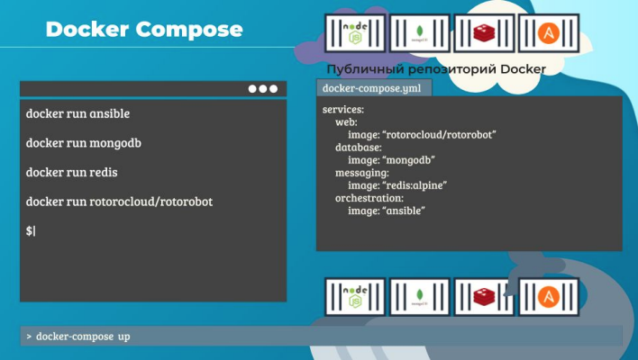
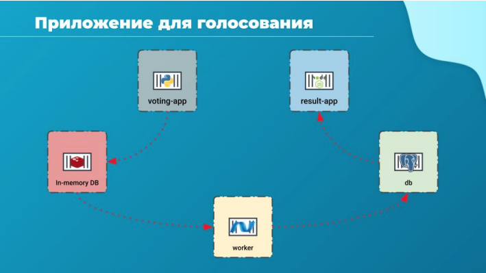
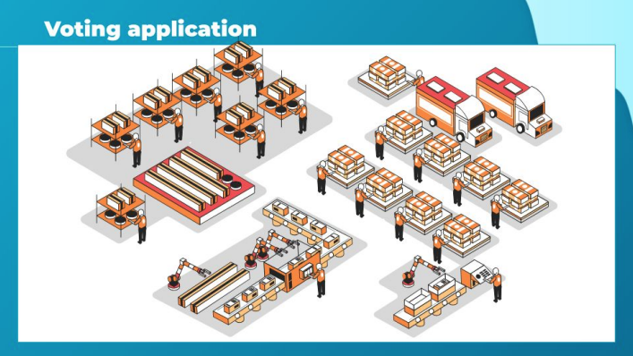
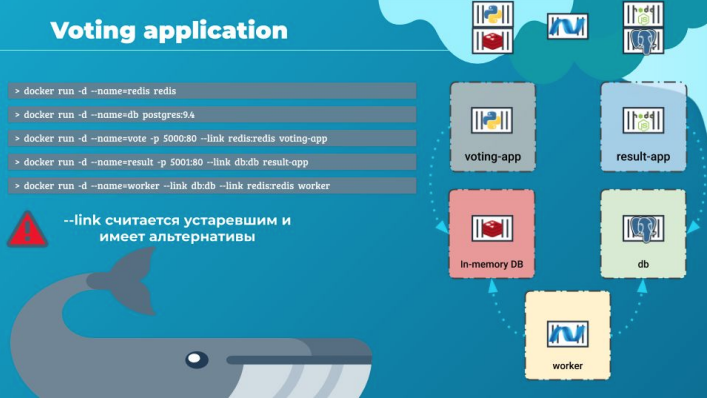
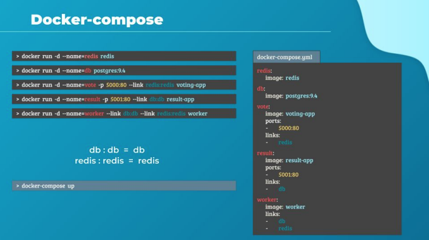
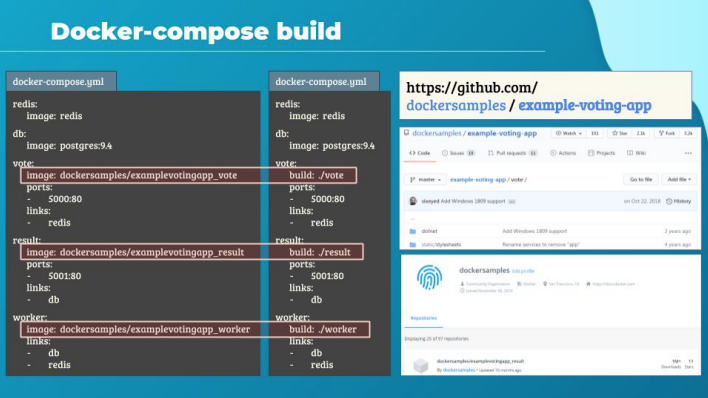
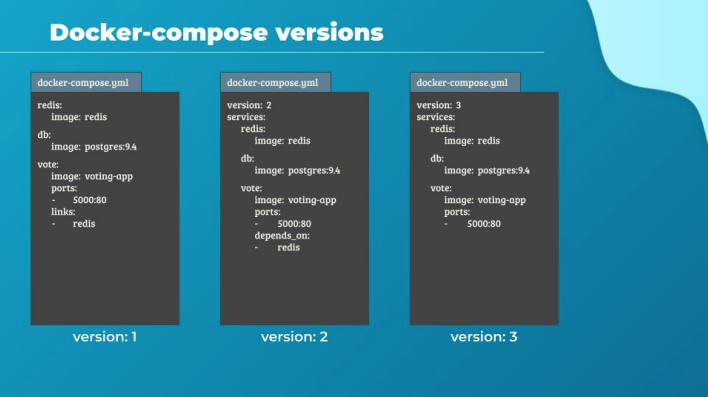
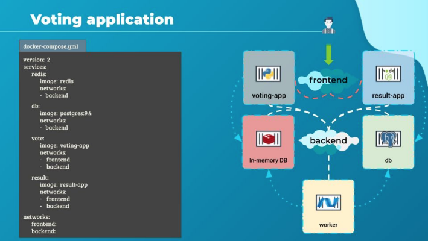
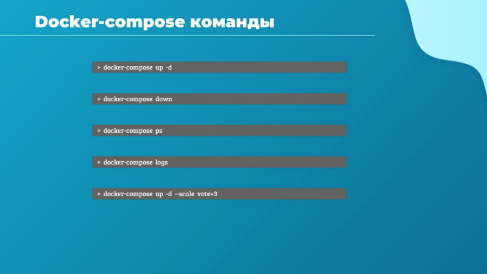

# Docker-compose

Привет и добро пожаловать на лекцию о Docker Compose. Дальше в лекции мы будем работать с
конфигурациями в Yaml-файлах. Поэтому важно, чтобы ты чувствовал себя комфортно с yaml. Для
новичков в yaml в секции приложений в конце курса есть материалы, которые помогут тебе быстро
освоиться в этом формате представления данных.

Давай быстро резюмируем несколько вещей. Мы знаем, как построить образ, как отправить его на
хранение и как запустить докер-контейнер с помощью команды `docker run`. Так, а если теперь нам
нужно настроить сложное приложение с несколькими компонентами, как нам поступить?

Можно написать скрипт с несколькими командами `docker run`. Но лучший способ сделать это -
использовать Docker Compose. Мы могли бы создать файл конфигурации в формате YAML под
названием docker-compose.yml и положить туда все различные службы и прописать параметры,
специфичные для их запуска. После этого, запустив команду `docker-compose up`, мы смогли бы
одномоментно вызвать весь стек приложения.

Такой вариант проще реализовать, запускать и поддерживать, чем отдельные контейнеры с bash
скриптами, поскольку все изменения всегда хранятся в одном файле конфигурации
docker-compose.yaml. Но тут есть определенные ограничения, т.к. все это применимо только к
запуску контейнеров на одном хосте Docker. Пока не будем беспокоится о моем yaml-файле.
Он вполне рабочий, но это слишком простое приложение, которое я собрал. Давай посмотрим на
лучший пример.

У нас есть приложение от создателей докера, на котором хорошо отрабатывать особенности этой
технологии. Итак, задача приложения собрать голоса пользователей, обработать их, сохранить и
показать результат по требованию. Приложение должно быть шустрое, выдерживать большую
пиковую нагрузку и быть устойчивым к сбоям.

Согласно этим требованиям разработчики создали приложение. Скорость будет достигаться за
счет использования технологий кэширования, вроде redis, масштабирование достигается за счет
контейнеризации, а устойчивость к сбоям за счет микросервисной архитектуры. Это тестовое
приложение для голосования имеет под собой три логических яруса: фронтенд, бекенд и обработка
данных.

Приложение для голосования - voting-app - разработано на Python, оно предоставляет веб-страницу
с двумя опциями: Cats и Dogs. После того, как пользователь сделал выбор, voting-app передает эти
данные для обработки в бэкэнд. Приложения voting-app и result-app несут в себе функции
представления данных и взаимодействия с пользователем, другими словами фронтенд. Задача
этих приложений устойчиво отработать под нагрузкой, дав нашим пользователям хороший опыт от
общения с системой - user experience - UX.

Если бы voting-app пыталось сразу записать данные в реляционную СУБД, вроде Postgres, мы бы
быстро уперлись в ограничение пропускной способности БД. Пока база обрабатывала все запросы,
наш портал example-vote.com был бы недоступным. Мы пойдем другим путем.
Для обеспечения быстрой работы используем временное хранилище данных redis. Благодаря тому,
что его база находится в оперативной памяти, voting-app очень быстро выполнит запрос и вернется
к своему привычному делу - показывать веб-страницу пользователю.

Итак, на первом этапе все данные стекаются в in-memory cache, реализованный в redis. Далее в
игру вступает третий компонент нашей системы - worker.

Worker это .net приложение, его функция периодически забирать информацию из кэша, производить
дополнительные действия по ее проверке и подготовке к хранению, а далее отправить этот "пакет"
данных в Postgres на постоянное хранение.

Реляционная база данных хранит свою информацию в виде таблиц, из-за этого скорость записи у
нее не так высока, как скорость чтения. Result-app демонстрирует результаты голосования,
вычитывая их из БД с вполне с приличной скоростью, а если этого вдруг станет не хватать, то
всегда можно будет подключить redis и к этому процессу.

Это все по архитектуре нашего simple voting application. Я бы сравнил это с фабрикой.

Кладовщики (python) имеют одну задачу - максимально быстро положить на склад (redis) все
прибывающие материалы (запросы от юзеров). Воркер - это автоматизированная линия, которая
постоянно производит свои товары из материалов (задания для БД из запросов). База данных
Postgres - склад готовой упакованной продукции, которую удобно будет использовать
потребителям. А служба доставки (NodeJS) - доставляет готовые результаты пользователям.

Как видишь решение наших разработчиков сочетает в себе несколько инструментов, платформ и
технологий. На его примере мы посмотрим, как легко можно настроить стек разнородных
компонентов в Docker.

На пару минут отложим в сторону все автоматизации вроде services от docker-compose и stacks от
Docker swarm и посмотрим, как мы можем собрать этот стек приложений на едином окружении
Docker, используя сначала обычные команды запуска.

Мы считаем, что все наши образы уже созданы и доступны в Docker-репозитории.

Давай начнем с уровня данных.
Для запуска используем команду `docker run`.
Начнем с redis.
Команда `docker run -d --name=redis redis`

Как мы знаем, параметр -d говорит Docker, что контейнер нужно запустить в фоновом режиме.
Также мы указываем имя контейнера redis. Имя контейнера важно, а почему, ты скоро поймешь.

Далее разворачиваем Postgres DB
Команда `docker run -d --name=db postgres:9.4`

-d значит тоже самое, что и в предыдущий раз - запуск в бекграунде. Имя для контейнера базы db.

Дальше очередь фронтенда. Запустим сборщик голосов командой
`docker run -d --name=vote -p 5000:80 voting-app`

Это приложение веб-сервер, слушает на http порту (#80), мы опубликуем его в хост-системе под
номером 5000. Таким образом трафик полученный на порт 5000 нашей хост-системы будет передан
на порт 80 контейнера vote, этим мы сделаем его доступным из браузера.

Приложение, показывающие результат result-app разворачиваем командой
`docker run -d --name=result -p 5001:80 result-app`

Здесь мы аналогично пробрасываем порты для доступности результатов из браузера.

В конце запустим worker
`docker run -d --name=worker worker`

Ок, вроде все идет неплохо. Контейнеры запустились. Но проблема в том, что обращение на 5000
порт из браузера - дает нам 500 ошибку.

Дело в том что мы запустили 5 контейнеров, а не микросервисное приложение. Приложением оно
станет, когда сервисы начнут общаться друг с другом, т.е. у контейнеров будет возможность
коммуницировать. Мы должны связать контейнеры и сказать каждой части приложения с кем им
взаимодействовать. Применительно к voting-app, нужно явно сказать с каким экземпляром redis
ему работать, т.к. redis может быть несколько. Тоже самое с worker, он должен понимать, какой
Postgres ему нужен.

Как нам это сделать? С помощью links. Link это опция командной строки, позволяющая связать два
контейнера вместе.

Например веб-сервис voting-app зависит от кэширующего сервиса redis. Когда веб-сервер
запустится этот код будет искать redis на хосте "redis". Но контейнер vote не сможет разрешить это
имя и понять, где находится его redis. Для осведомления voting-app о том, где находится redis мы
используем опцию link при запуске контейнера-голосования.

Пишется так --link (имя контейнера где живет сервис):(имя по которому будет общаться с этим
контейнером запускаемое приложение).

В нашем случае `docker run -d --name=vote -p 5000:80 --link redis:redis voting-app`.

Вот поэтому ранее я говорил, что имена контейнеров важны! Чтобы мы смогли связать требуемые
компоненты.

Что на самом деле делает --link? Просто вносит статическую запись в /etc/hosts контейнера vote с
привязкой имени redis к текущему внутреннему IP контейнера redis.

Таким же способом мы связываем контейнер result с контейнером db.

`docker run -d --name=result -p 5001:80 --link db:db result-app`.

Как видишь, в коде NodeJS-приложения название базы просто захардкожено. Это не лучшая
практика, но для учебных целей можно.

Контейнер worker немного отличается от предыдущих, т.к. ему потребуется общаться сразу с двумя
контейнерами: брать данные в redis и отправлять их в db.

Просто добавим два линка:
`docker run -d --name=worker --link db:db --link redis:redis worker`

На самом деле link устаревшая конструкция. На смену ей пришли более продвинутые концепции
networks, но для понимания основ конструкция link нам подходит, в любом случае лишним не будет
знать об этой возможности.

Итак, у нас есть проверенные и готовые к использованию команды Docker. Из него будет легко
создать файлы для docker-compose. Начнем с dictionary имен контейнеров. Мы будем создавать его
используя те же названия, что и в командах docker run.

Теперь мы берем все имена микросервисов и создаем ключ для каждого из них. Затем под
каждым элементом мы указываем, какой использовать образ. Ключ - это будущий контейнер, а
значение - имя образа, которое будет в нем использоваться.

Также мы использовали дополнительные параметры в командах, а именно в двух командах
публиковали порты. Для этих контейнеров мы укажем проброс соответствующих портов. Создаем
свойство под названием ports и перечисляем все порты, которые мы хотим опубликовать под ним.

Наконец у нас остались links. Те контейнеры, которые нужно связать друг с другом следует явно
обозначить. За это отвечает свойство links. Это свойство является массивом, таким же как и ports.

Заметь, если имя службы, к которой идет обращение в коде совпадает с именем контейнера,
например redis или db, то можно указать это имя один раз без двоеточия. Это будет тоже самое,
как если бы указали redis:redis или db:db.

Мы закончили с нашим файлом конфигурации, и теперь поднять стек на самом деле очень легко.
Делаем это командой `docker-compose up`.

В созданном нами файле docker-compose.yml мы исходили из того, что все образы уже собраны. Из
пяти различных компонентов два известных нам образа redis и postgres уже доступны на
DockerHub.

Это официальные образы от Redis и Postgres, но остальные три - наше собственное приложение.
Совсем необязательно, чтобы они были уже созданы и записаны в какой-то докер-репозиторий.
Если мы хотим проинструктировать Docker инициировать процесс сборки образа вместо
скачивания уже созданного из репозитория, мы можем поменять параметр image на build, указав
местоположение каталога, который содержит код приложения и Dockerfile с инструкциями по
сборке образа.

В этом примере у приложения для голосования весь код лежит в папке с именем vote, также она
содержит Dockerfile. Итак, когда мы запустим команду `docker-compose up`, она сначала соберет
образ, даст ему временное имя, а затем будут использовать этот образы для запуска контейнера с
использованием указанных в файле параметров. Аналогичным образом будут созданы две
оставшиеся службы: образы будут собраны из соответствующих папок и запущены их контейнеры

Теперь мы рассмотрим разные версии файла docker-compose. Это важно, потому что мы постоянно
сталкиваемся с разными docker-compose файлами в разных форматах. Возникает вопрос, почему в
разных местах они выглядят по-разному?
Docker-compose с течением времени развивался и сейчас поддерживает гораздо больше
возможностей, чем вначале. Вот, например, урезанная версия файла docker-compose, которую мы
использовали ранее.

Фактически это ранняя версия docker-compose, которая называется версия 1. У ней есть ряд
ограничений, например, невозможно развернуть контейнеры в другой сети, отличной от мостовой
сети по умолчанию. Также нет возможности указать, что запуск одного контейнера зависит от
запуска другого. Например, наш контейнер базы данных должен появиться первым, и только после
этого должно быть запущено приложение для голосования. Мы не можем указать это в версии 1
файла docker-compose.

Этот функционал стал поддерживаться только с версией 2 и выше. С версией 2 также немного
изменился и формат файла. Мы больше не указываем информацию о стеке напрямую, как раньше.
Все это стало инкапсулировано в раздел services. Поэтому нам нужно создать свойство с именем
services в корневом уровне yml файла, а затем переместить все описания контейнеров в этот раздел
служб. Чтобы мы по-прежнему могли использовать эту же команду `docker-compose up` для
вызова своего стека приложений, нужно явно сообщить docker-compose, какую версию файла мы
здесь используем. Мы свободно можем использовать версию 1 или версию 2 в зависимости от
своих потребностей. Итак, чтобы все это работало, в первой строчке мы указываем, как
docker-compose разбирать форматирование. Используется параметр version: и указание версии.

В этом случае цифра 2 после двоеточия сразу скажет docker-compose объединить контейнеры в
единую мостовую сеть, а затем использовать ссылки для связи между контейнерами, как мы это
делали явно в первой версии нашего файла.

Это еще одно отличие первой версии от второй, что контейнеры сразу могут связываться друг с
другом, используя имена, заданные под параметром services. Т.е. во второй версии docker-compose параметр links больше не
нужен. Мы можем просто избавиться от всех ссылок, которые были
созданы, при конвертации docker-compose файла из версии 1 в версию 2.

И, наконец, версия 2 также вводит функцию зависимостей для запуска, если мы хотим указать
порядок создания контейнеров. Например, веб-приложение для голосования зависит от службы
redis. Таким образом, нам необходимо убедиться, что контейнер redis запускается первым, и
только после этого запускается веб-приложение для голосования. Мы можем добавить свойство
depends_on, в приложение для голосования и указать, что оно зависит от redis.

Теперь версия 3. На сегодняшний день последняя версия 3.8. Ее структура сходна с версией 2.
Вверху описание версии, далее идет раздел services, в который мы также помещаете все свои
контейнеры, как и в версии 2. Существенное отличие в 3 версии - ее поддержка оркестрации с
помощью Docker swarm и специфичных возможностей для совместной работы нескольких хостов.

В ней некоторые параметры были удалены, и многие добавлены. Увидеть подробности ты можешь
в разделе документации на сайте docker, поискав по слову compose. В следующих лекциях мы
взглянем на версию 3 более подробно, когда обсудим Docker Stacks.

Сейчас давай поговорим о сетях в docker-compose касательно нашего приложения. До сих пор мы
просто развертывали все контейнеры в мостовой сети по умолчанию. Хорошей практикой является
разделить трафик из разных источников. Давай немного изменим архитектуру нашего
развертывания.

Например, мы решили отделить трафик, генерируемый пользователями, от внутреннего трафика
приложений. Для этого мы создаем внешнюю сеть, предназначенную для трафика от
пользователей, и внутреннюю сеть, предназначенную для общения между приложениями.

Фронтенд и бэкенд. Сетью фронтенда связываем приложения, ориентированные на пользователя,
это приложение для голосования и для результатов. Бэкендом свяжем внутренние компоненты:
redis, postgres и worker. Все это мы можем занести в наш файл docker-compose.yml

Обрати внимание, что я вырезал раздел портов для простоты, они все еще там, но просто не
показаны на экране.

Первое, что нам нужно сделать, если мы будем использовать networks, - это определить какие
именно сети мы собираемся использовать в этом развертывании. У нас есть две: внешняя и
внутренняя сети. Поэтому создадим новое свойство, называемое networks, на уровне корня yaml
документа, а не в services. В этом свойстве мы разместим нашу карту сетей. Мы планируем
использовать эти сети во всех объявленных службах. Таким образом нам придется их явно
объявить при помощи свойства networks уже внутри имени службы, к каким сетям должен быть
подключен этот контейнер.

В данный момент мы указали, что result подключен к сети frontend и backend. потому что это
приложение берет данные из внутренней сети и отдает их во внешнюю. Так же и для vote. К каким
сетям будут подключены службы redis и dB?

Это только backend, т.к. эти приложения не взаимодействуют с пользователем. В отличие от
интерфейсных приложений, таких как приложение для голосования и результатов, которые
необходимо подключить как к фронтенду, так и к бэкенду. Мы также должны добавить раздел
networks для воркера, чтобы его контейнер был добавлен во внутреннюю сеть, здесь просто не
хватило на него места.

Теперь, когда мы разобрали эти файлы docker-compose переходим к практике, чтобы
потренироваться в составлении подобных yaml файлов. Но перед этим я хочу показать тебе
несколько основных команд Docker Compose.

`docker-compose up -d`
Разворачивает стек из файла docker-compose.yml текущей директории.

`docker-compose down`
Останавливает стек и удаляет все контейнеры и сети.

`docker-compose ps`
Покажет контейнеры, за которые Docker Compose несет ответственность.

`docker-compose logs`
Общий пул логов поднятого стека Docker Compose.

`docker-compose up --scale vote=3`
Управление количеством реплик определенной службы.
