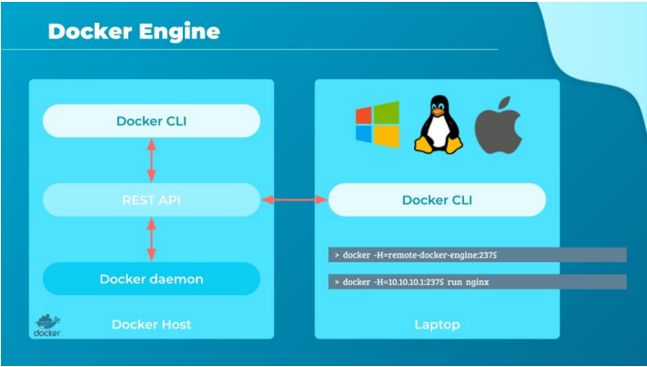
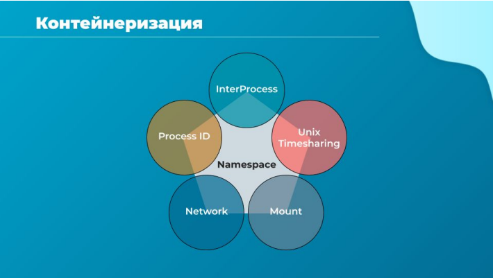
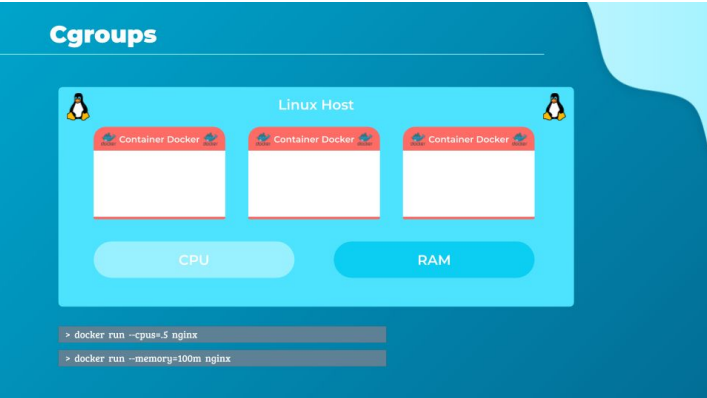

# Среда выполенения

Добро пожаловать на эту лекцию о движке Docker. В этой лекции мы более подробно рассмотрим
архитектуру Docker, на чем основана магия изоляции контейнеров и какие технологии у него "под
капотом".

Движок Docker (Docker engine), как мы узнали ранее, работает на хосте с установленным Docker.
Это такой комбайн, который умеет многие вещи:

- собирать образы
- запускать контейнеры
- транспортировать образы
- оркестрировать контейнеры (в случае swarm)
- обслуживать отдельные слои
- делать траблешутинг

С одной стороны это удобно, с другой стороны универсальность сыграла с Docker в минус. Об этом
мы поговорим еще в разделе окрестрации. В данный момент речь об архитектуре.

Итак, когда мы устанавливаем Docker на хост Linux, фактически мы устанавливаем три разных
компонента:

- Демон Docker
- REST API-сервер
- приложение командной строки докера.

Docker-daemon - это фоновый процесс, который управляет объектами Docker, такими как образы,
контейнеры, тома и сети.

API-сервер Docker поддерживает API, который программы могут использовать для общения с
демоном и предоставления инструкций. Ты можешь создать свои собственные инструменты,
используя этот REST API. Кстати, на этом принципе построены наши лабораторные работы.

Docker cli - это утилита командной строки, которую мы использовали до сих пор для выполнения
таких действий, как запуск и остановка контейнеров, уничтожение образов и т. д. Она использует
вызовы REST API для взаимодействия с демоном Docker.

Следует отметить, что утилита командной строки Docker не обязательно должна находиться на
одном хосте. Этим докер-хостом может быть другая система, например, я могу управлять
серверным удаленным движком Docker, работающим на сервере в ДЦ со своего ноутбука. Чтобы
использовать такой вызов к команде docker нужно добавить параметр -H, далее указать адрес
удаленного хоста и его порт. Также можно проиниализировать переменную окружения
DOCKER_HOST для постоянных вызовов к определенному хосту.

Как показано здесь, для запуска контейнера на основе Nginx на удаленном хосте Docker запустим
команду: `docker -H 10.10.10.1:2375 run nginx`

Теперь давай попробуем разобраться, как именно в Docker контейнеризирует приложения чуть
ниже уровнем, что называется "под капотом".

В случае Linux Docker использует пространство имен (namespaces linux) для изоляции
идентификаторов процессов рабочего пространства, подключения к сети, системы разделения
времени Unix. Процессы контейнера выполняются в их собственном пространстве имен, тем
самым обеспечивая изоляцию с другими процессами. Если тебе не очень ясно, это нормально.
Когда я впервые об этом услышал, я ничего не понял, поскольку раньше не встречался с
namespaces.

Давай посмотрим на пару примеров. Сначала как работает изоляция процессов - изоляция в PID
namespace.

Всякий раз, когда система Linux загружается, она запускается только с одного процесса. У него
process identificator = 1. Так устроен Linux. Это корневой процесс, запускающий все остальные
процессы, они как бы отпочковываются от него. После загрузки у нас бежит несколько процессов
одновременно. Выполним команду `ps`, чтобы вывести список всех запущенных процессов.
Процессы уникальны, и два процесса не могут иметь одинаковый идентификатор процесса.

Теперь, мы создали контейнер, он будет похож на дочернюю систему, размещенную в текущей
системе. Дочерняя система должна думать, что она является независимой системой, что она сама
по себе. Таким образом у нее должен быть свой собственный набор процессов, порожденных от
корневого процесса №1, а также прочие атрибуты независимой системы.

Да, как видишь у нее присутствует процесс с ID 1, но мы знаем, что между контейнерами и базовым
хостом нет жесткой изоляции. Таким образом, процессы, выполняемые внутри контейнера, на
самом деле являются процессами, выполняемыми на базовом хосте. Но у двух процессов не
может быть одного и того же PID. Для хоста все процессы должны быть уникальны. Но внутри
контейнера все иначе. Он по другому нумерует процессы, он же считает себя независимым.

Нам нужно как-то урегулировать этот конфликт. Здесь вступает в игру PID namespace. Эта штука
позволяет добавить к процессу помимо его настоящего ID еще и другой. Также она будет понимать,
каким службам давать первичный PID, а кому "фейковый". С каждым процессом может быть
связано несколько таких ID процесса.

В нашем случае, когда процессы запускаются в контейнере, это фактически просто еще один набор
процессов в базовой системе Linux, и они получат следующий доступный идентификатор процесса
в хостовой системе. Т.е. пять и шесть. Однако, они также получают другой идентификатор процесса
начиная с PID 1 в пространстве имен контейнера, которое видно только внутри контейнера. Наш
контейнер имеет собственное корневое дерево процессов и поэтому является независимой
системой. Точнее считает себя таковой. Итак, как это связано с реальной системой?

Допустим я запустил на своем хосте с адресом 10.0.0.13 другую ОС в контейнере с адресом
172.17.0.2.

Теперь я зайду с двух терминалов на докерхост и в контейнер.
И там и там я выполню команду `ps aux`.

В контейнере я увижу два процесса:

- с PID 1, это bash в котором я нахожусь
- с PID 10 это только что выполненная команда `ps aux`

На хосте после целой простыни процессов, в конце я увижу интересные для меня:

- с PID 2945 это bash, который работает в данный момент в контейнере
- с PID 3119 это `ps aux`, который только отработал в контейнере
- с PID 3129 это `ps aux`, который только отработал в на хосте

Как видишь, контейнер думает, что корневой процесс это bash и у него PID = 1, но его реальный PID 2945.

Я бы сравнил жизнь контейнера с параллельной вселенной, в которой уютно живется процессам
контейнера, они не видят остального мира, но докер-хост видит его процессы полностью.

Теперь представим, что мы отключили изоляцию PID. Что бы произошло? Процессы в контейнере
приобрели такие же PID номера, что и в хостовой системе. Работа приложения в контейнере
конечно будет нарушена. Получается, контейнер стал не таким изолированным, мы как бы
совместили его реальность с хостовой.

Давай зайдем еще дальше и отключим изоляцию UTS, которая отвечает за имя хоста. Как видишь
мы еще больше совместили контейнер и низлежащую ОС.

Теперь отключим изоляцию MNT и NET. Т.о. контейнер не сможет иметь свой собственный IP и
собственную файловую систему. Теперь он полностью совпадает с ОС, он больше не изолирован.

Как ты понимаешь, перегородки в этом общежитии контейнеров достаточно эфемерные, потому
что и базовый докер-хост, и контейнеры совместно используют одни и те же системные ресурсы,
такие как процессор и память.

Ок, я надеюсь стало более понятнее, почему контейнер это совсем не виртуальная машина.

Это подводит нас к вопросу сколько ресурсов будет выделено для хоста и контейнеров, а также
как Docker управляет ресурсами и делится ими между контейнерами.

По умолчанию нет ограничений на то, сколько ресурсов может использовать контейнер, и,
следовательно, контейнер может в конечном итоге использовать все ресурсы на базовом хосте. Но
есть способ ограничить объем ЦП или памяти, который может использовать контейнер. Docker
использует контрольные группы (cgroups), чтобы ограничить количество аппаратных ресурсов,
выделяемых каждому контейнеру. Это можно сделать, установив параметр --cpus в команде
запуска контейнера.

Например, `docker run --cpus=.5 nginx` позволит Docker использовать одномоментно не более 50%
вычислительной мощности хоста.

То же самое и с памятью: `docker run --memory=100m nginx`.

Данная команда ограничит использование оперативной памяти контейнера лимитом в 100мб.

Я привел лишь два примера, возможности Docker в части управления ресурсами достаточно гибкие.
Если хочешь узнать больше, поищи в документации докера по слову limits или "resource constraints".
