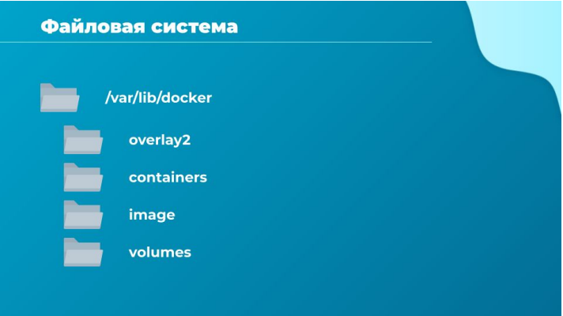
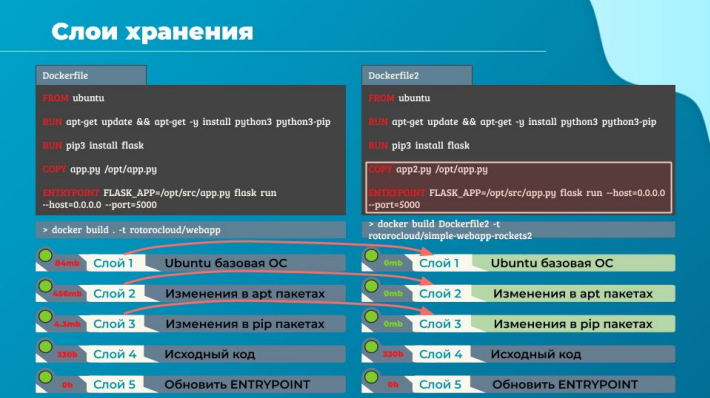
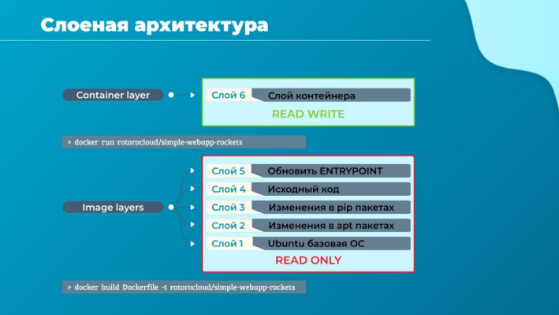
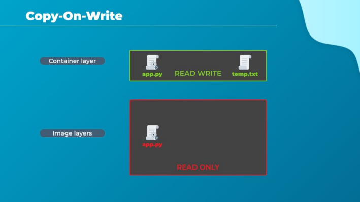
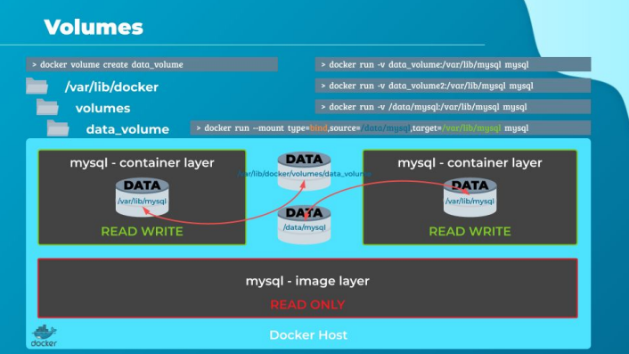
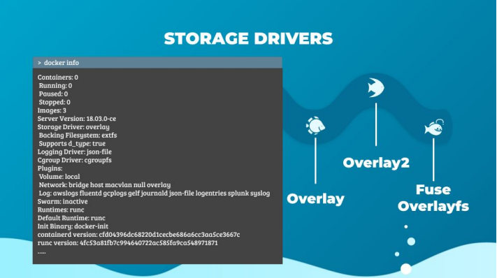

# Хранилище

Привет и добро пожаловать на лекцию. В этой лекции мы изучаем продвинутые концепции Docker,
а именно поговорим драйверах хранилища Docker и файловых системах. Мы посмотрим, где и как
Docker хранит данные, и как он управляет файловыми системами контейнеров.

Давай начнем с того, как Docker хранит данные в локальной файловой системе.

Когда мы устанавливаем Docker в систему, он создает некоторую структуру папок в каталоге
/var/lib/docker. Там находится несколько папок, с названиями overlay2, containers, image, volumes и
т. д. Здесь Docker по умолчанию хранит все свои данные. Когда я говорю «данные», я имею в виду
файлы, связанные с образами и контейнерами, запущенными на этом докер-хосте. Например, все
файлы, относящиеся к контейнерам, хранятся в папке containers, а файлы, связанные с образами,
хранятся в папке image. Любые тома, созданные для докер-контейнеров, создаются в папке
volumes.

Что ж, пока не беспокойся об этом. Мы вернемся к этому чуть позже. А пока давай просто
разберемся, где Docker хранит свои файлы и в каком формате. Итак, как именно Docker хранит
файлы образа и контейнера?

Чтобы это хорошо понять, нужно вникнуть в многоуровневую или слоеную архитектуру Docker.
Давай быстро вспомним то, что мы узнали об этом.

Когда Docker создает образы, он создает их в многоуровневой архитектуре. Каждая строка
инструкции в Dockerfile создает новый слой в докер-образе с фиксацией изменений от
предыдущего уровня.

Например, первый уровень - это базовая операционная система Ubuntu, за которой следует вторая
инструкция, которая создает второй слой, который устанавливает все пакеты APT. Затем третья
инструкция создает третий уровень, который занимается пакетами python, за которым следует
четвертый уровень, который копирует исходный код. И, наконец, пятый слой, который обновляет
точку входа образа.

Поскольку каждый слой сохраняет только изменения из предыдущего, это отражается и на
размере. Если мы посмотрим на базовый размер образа, он имеет размер около 80 мегабайт.
Пакеты apt, которые были установлены составляют около 450 МБ, а оставшиеся слои малы, чтобы
понять преимущества этой многоуровневой архитектуры.

Теперь посмотрим второе приложение, в котором есть другой Dockerfile, но он очень похож на наше
первое приложение. В нем используется тот же базовый образ, что и раньше, это ubuntu и оно
использует те же зависимости Python и Flask, но имеет в себе другой исходный код для создания
образа и также другую точку входа.

Когда я запускаю команду `docker build`, чтобы создать новый образ для этого приложения, первые
три уровня обоих приложений будут одинаковы и Docker не будет создавать эти первые три уровня.
Вместо этого он повторно применит одинаковые, уже созданные первые три слоя, которые он
сделал для первого приложения. Их он возьмет из кэша, в который ложит все слои, когда-либо
собранные на докер-хосте.

Далее, он создаст только последние два слоя с новым исходным кодом и новой точкой входа.
Вновь собранные слои он также положит в кэш. Таким образом Docker создает образы быстрее и
эффективно экономит дисковое пространство.

Это также применимо, если требуется обновить код своего приложения. Всякий раз, когда нужно
обновить исходный код, например app.py, как в нашем случае, Docker просто повторно использует
все предыдущие слои из кэша и быстро перестроит образ приложения, обновив слои с исходным
кодом и следующие за ним. Таким образом, это сохранит нам много времени во время перестроек
и обновлений образов.

Для наглядности, давай разместим слои снизу вверх, чтобы мы могли все это лучше понять.

Внизу у нас есть базовый уровень ubuntu, затем пакеты, затем зависимости, а затем исходный код
приложения и точка входа. Все эти слои создаются, когда мы запускаем команду `docker build`.
Формируется окончательный образ Docker, состоящий из этих слоев. После завершения создания
образа мы не можем изменять содержимое этих слоев, они доступны только для чтения, а
изменить их возможно только через запуск новой сборки.

Когда мы запускаем контейнер, основанный на этом образе при помощи команды docker run,
Docker создает контейнер на основе этих слоев, а далее создает новый слой поверх слоев образа, с
которого можно не только читать, но и в который можно писать. Слой с возможностью записи
используется для хранения и изменения данных, созданных контейнером. Таких данных, как логи,
временные файлы и прочие вещи, необходимые для работы приложения. В него также попадает
любой файл, измененный пользователем в этом контейнере. Срок жизни этого слоя ограничен
временем, пока жив контейнер. Когда контейнер разрушается, этот слой со всеми сохраненными в
нем изменениями уничтожается.

Помни, что одни и те же слои образа делятся между всеми контейнерами, запущенными с
использованием этого образа. Скажем, я зайду в созданный контейнер и создам там новый файл с
именем temp.txt. Этот файл будет создан на уровне контейнера, который доступен для чтения и
записи.

Как мы только что сказали, что файлы в слоях образа доступны только для чтения, что означает,
что мы не можем ничего редактировать в этих слоях. Теперь давай возьмем пример кода нашего
приложения, поскольку мы запекли наш код в образ. Код является частью одного их слоев образа,
и, следовательно он будет доступен только для чтения после запуска контейнера. Что, если я хочу
изменить исходный код, скажем для какого-то теста?

Вспоминаем, что один и тот же слой образа может использоваться несколькими контейнерами,
созданными из этого образа. Значит ли это, что я не могу изменить этот файл внутри контейнера?

Нет, я все еще могу изменить этот файл, но прежде, чем я сохраню измененный файл, Docker
автоматически создает копию файла на уровне чтения и записи, и затем я буду изменять и работать
уже с другой версией файла, которая уже будет находится в другом слое - в слое контейнера, слое
чтения и записи. Все будущие изменения будут внесены в эту копию файла на уровне
чтения-записи. Это называется механизмом копирования при записи (copy-on-write).

Слои образа доступны только для чтения, это означает, что файлы в этих слоях не будут изменены
на самом деле, образ будет оставаться неизменным все время, пока ты не перестроишь его с
помощью команды `docker build`.

Итак, пока файлы не изменились, их не существует в слое контейнера. Они все где-то в слоях
образа. Что происходит, когда мы избавляемся от контейнера?

Все данные, которые хранились на уровне контейнера, также удаляются. Изменения, которые мы
внесли в app.py и новый временный файл, который мы создали, также будут удалены. А что, если
мы хотим сохранить эти данные?

Например, мы работали с базой данных и хотели бы сохранить данные, созданные контейнером.
Для этих целей мы можем добавить в контейнер постоянный том (volume).

Чтобы сделать это, сначала создадим том с помощью команды `docker volume create`.

Когда мы запускаем команду `docker volume create data_volume`, она создает папку с именем
data_volume в каталоге /var/lib/docker/volumes. Затем, когда я запускаю докер-контейнер с
помощью команды `docker run`, я могу смонтировать этот том внутрь контейнера для чтения и
записи, используя опцию -v, как ты видишь на экране.

Я указал в `docker run -v` и имя моего вновь созданного тома, за которым идет двоеточие и
местоположение внутри моего контейнера, которым является местоположением по умолчанию,
где MySQL хранит данные, т.е. /var/lib/mysql. Далее указал имя образа.

Теперь Docker создаст новый контейнер и смонтирует созданный ранее том в папку /var/lib/mysql
внутри контейнера, и все данные, записанные базой данных, фактически будут хранится в томе,
созданном на докер-хосте. Даже если контейнер разрушится, данные остаются целыми. А что, если
мы не запускали команду `docker volume create` для создания тома, прежде чем сделали `docker
run`?

Например, я запускаю команду `docker run` для создания нового экземпляра контейнера mysql с
параметром монтирования тома data_volume_2, но том я еще не создал. В таком случае Docker
автоматически создаст том с именем data_volume_2 и подключит его к контейнеру. Мы можем
найти все эти созданные тома, если просмотрим содержимое папки /var/lib/docker/volume. Это
называется volume mounting, поскольку мы монтируем том, созданный Docker в папке
/var/lib/docker/volume. Но что, если мы уже разместили данные в другом месте и не хотим их
переносить в папку /var/lib/docker/volume?

Например, у нас есть директория в хранилище докер-хоста в размещении /data, и мы хотели бы
хранить данные базы данных в качестве тома в этой папке, а не в директории томов docker по
умолчанию. В этом случае мы также запустим контейнер с помощью команды `docker run -v`. Но в
этом случае мы предоставим полный путь в папку, которую хотим смонтировать. Это /data/mysql, и
Docker создаст контейнер и подключит папку к контейнеру. Это называется bind mounting.

Таким образом, существует два типа монтирования: монтирование тома и монтирование с
привязкой. Volume mounting монтирует том из каталога томов, а bind mounting монтирует каталог из
любого места на докер-хосте.

И напоследок отмечу, что использование -v - это старый стиль. Новый способ - использовать опцию
--mount. Это считается более предпочтительным способом, поскольку он более подробный, хотя на
практике я его встречаю реже. В этом случае, мы должны указать каждый параметр в формате
«ключ равно значение». Например, предыдущая команда может быть записана с параметром
--mount, и далее указав опции source и target. Type этом случае - bind, источник - это
местоположение на моем хосте, а цель - это местоположение в моем контейнере.

Ок, а кто несет ответственность за выполнение всех этих операций. Сохранение многоуровневой
архитектуры. Создание слоя с возможностью записи, перемещение файлов между слоями для
возможности копирования и записи и т. д.

Это storage drivers. Таким образом, Docker использует драйверы хранилища для обеспечения
многоуровневой архитектуры. Некоторые из распространенных драйверов хранения: AUFS, BTRFS,
ZFS, device-mapper, overlay и overlay 2, fuse overlayfs. Некоторые из них широко используются,
некоторые уже устарели, но могут встретиться в каких-то легаси нагрузках.

Выбор драйвера хранилища зависит от используемой ОС. Например, у Ubuntu.
Драйвер хранилища по умолчанию для нее - это overlay2. Но до 18 версии Docker это был aufs, и он
был недоступен в таких операционных системах, таких как Fedora или CentOS, и в них приходилось
использовать device-mapper.

Docker сам постарается выбрать лучший драйвер хранилища, который доступен в конкретной
операционной системе. Но это не всегда работает хорошо. В случае проблем нужно настраивать
руками, изучив соответствующие issues по конкретной ОС и ее ядру. Где-то до 18 года это было
серьезной проблемой, с появлением overlay2 дела стали обстоять гораздо лучше.

Различные драйверы хранилища также обеспечивают разные характеристики производительности
и стабильности, поэтому ты можешь выбрать тот, который соответствует потребностям твоего
приложения и соответствии требования твоей организации. Если хочешь быть осведомленным о
каком-либо из этих драйверов хранения, начни с документации Docker, а далее погрузись в десятки
issues на гитхаб докера.
