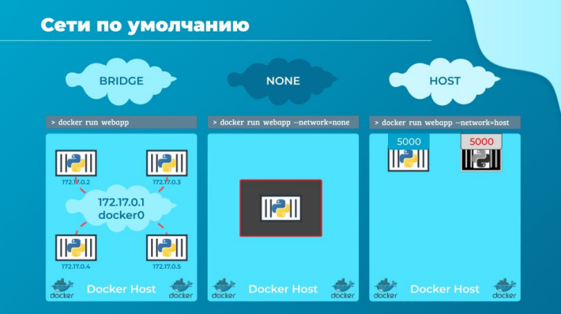
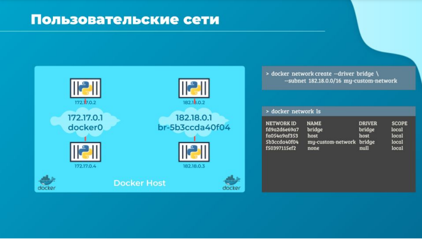
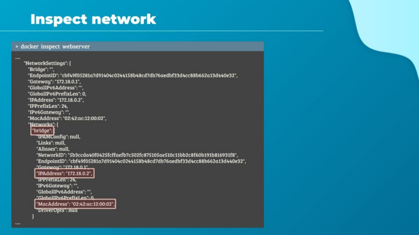

# Сеть в Docker

Когда мы устанавливаем Docker, он автоматически создает три сети:
- bridge
- none
- host

Мостовая (bridge) сеть - это сеть по умолчанию, к которой подключается контейнер. Если мы хотим
связать контейнер с любой другой сетью, то потребуется явно указать информацию о сети.
Используй параметр --network командной строки, как я показал на экране. Мы сейчас рассмотрим
каждую из этих сетей поближе.

Сеть Bridge - это частная внутренняя сеть, созданная Docker на хосте. Все контейнеры подключены
к этой сети по умолчанию. Как правило диапазон этих внутренних IP-адресов 172.17, но это
настраивается. Контейнеры получают доступ друг к другу, используя этот внутренний IP-адрес.
Если требуется доступ к какому-то из этих контейнеров из внешнего мира, нужно сопоставить
порты контейнеров с портами на докер-хосте.

Другим способом доступа к контейнерам извне, о котором я упомянул, является вариант прямого
связывания контейнера с сетью хоста. Это убирает всю сетевую изоляцию между докер-хостом и
докер-контейнером. Что будет означать, если мы запускаем веб-сервер на порту 5000 в
веб-контейнере, он автоматически становится доступным извне на том же порту своего хоста, без
необходимости какого-либо сопоставления портов.

Здесь этот веб-контейнер будет использовать все сетевые ресурсы своего хоста. И это также
будет означать, что, в отличие от прошлого примера, теперь мы не сможем запускать несколько
контейнеров в одном хосте на одном и том же порту. Поскольку теперь нет ни внутренних и не
внешних портов, порты являются общими. Службы самого хоста, разумеется, также занимают
какие-то порты, и это нужно учитывать размещая контейнеры в сети типа host.

Теперь сеть none. Контейнеры не являются членами какой-либо сети и не имеют доступа к внешней
сети или другим контейнерам, которые запущены в изолированных сетях.

На самом деле это еще не все. Для нагрузок, связанных с оркестрацией есть тип сети Overlay. Этот
тип сети адаптирован для работы одной сети на нескольких узлах. Далее в Docker есть тип Macvlan,
она будет интересна, если ты собираешься докеризировать нагрузки, которые раньше
размещались в виртуальных машинах, эта штука полностью эмулирует физический хост в части
сети. Также Docker позволяет с разной степенью успешности интегрировать кастомные сетевые
плагины.

Эти сети узко специфичные, и о них мы будем говорить в продвинутом курсе Docker.

Итак, мы только что увидели мостовую сеть по умолчанию с идентификатором 172.17.0.1. Таким
образом, все контейнеры, ассоциированные с этой сетью, смогут общаться друг с другом.

Но что, если мы хотим изолировать контейнеры внутри докер-узла, например, первые два
контейнера во внутренней сети 172 и два вторых контейнера в другой внутренней сети, например 182?

По умолчанию Docker создает только одну внутреннюю мостовую сеть. Но мы можем сами создать
свою собственную внутреннюю сеть с помощью команды `docker network create` и указать тип сети
в параметре --driver, в нашей команде это bridge.

Мы указываем диапазон адресации новой сети в CIDR нотации после параметра --subnet. В этом
случае 182.18.0.0/16 и за ним следует пользовательское имя этой новой изолированной сети.
Теперь запустим команду `docker network ls`, чтобы вывести список всех сетей.

Для того, чтобы увидеть настройки сети и IP-адрес, назначенный существующему контейнеру,
запустим команду `docker inspect` с названием контейнера или его ID. Там, в разделе
NetworkSettings -> Networks мы можем увидеть тип сети, к которой контейнер привязан, его
внутренний IP-адрес, Mac-адрес.

Как ты помнишь в bridge network другие контейнеры могут связываться друг с другом, используя
свои имена. Например, здесь у меня есть веб-сервер и контейнер базы данных MySQL, работающие
на одном хосте в одной сети. Как я могу реализовать доступ для моего веб-сервера к базе данных в
контейнере?

Один из вариантов, который я мог бы сделать - это использовать внутренний IP-адрес,
назначенный контейнеру MySQL, который в данном случае 172.17.0.3. Но это не очень правильно,
поскольку не гарантируется, что контейнер получит тот же IP-адрес, когда система перезагрузится
или контейнер по какой-то причине сломается и его место займет новый. Лучший способ сделать
это - использовать имя контейнера.

Все контейнеры на докер-хосте могут находить адреса друг друга с помощью имени контейнера.
Docker имеет встроенный DNS-сервер, который помогает контейнерам разрешать имена друг друга.
Обрати внимание, что встроенный (embedded) DNS-сервер всегда работает по адресу 127.0.0.11.
Вот так Docker реализует сети. А какие технологии стоят за этим?

Это изоляция network namespace. Т.е. для каждого контейнера используется свое пространство
имен, которые позволяют разному трафику передаваться и обрабатываться по разным правилам, и
делать это рядом друг с другом и незаметно друг для друга. Также используются виртуальные
Ethernet адаптеры для соединения контейнеров вместе.
