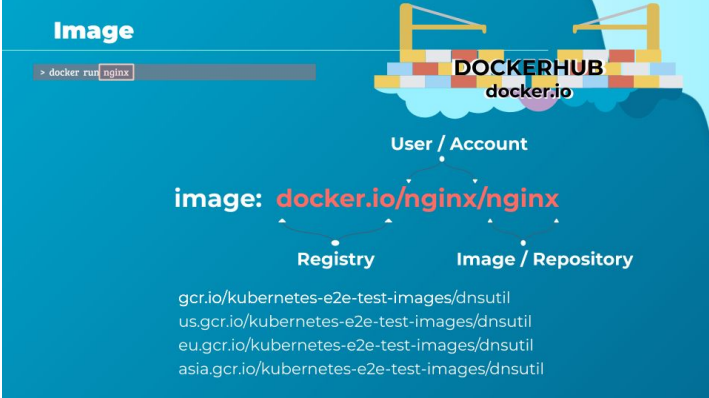
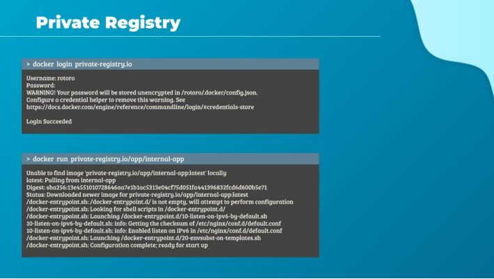
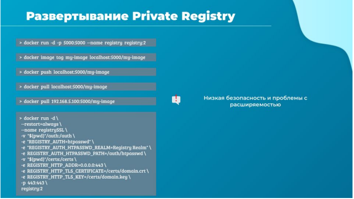

# Docker Registry

Привет. В этой лекции мы посмотрим на Docker registry.

Реджистри - это сервер, который позволяет поддерживать репозитории докер-образов. Он
позволяет хранить и распространять эти образы.

Иногда это выражение используют в более широком смысле, говоря о реджистри, как о том месте,
где хранятся образы. Мы уже привыкли, что образы лежат на докерхабе, но это не всегда верно. В
продакшене в основном используют частные докер-реджистри.

Для построения добротных DevSecOps-конвейеров используют приватные репозитории, в которых
образы проходят необходимые этапы тестирования, секьюрити и комплаенс проверки. Также эти
реджистри используют при разработке для кэширования часто используемых образов (в свете
введенных Docker ограничений это актуально) или для пуллинга предварительно подготовленных
образов, когда в компании существует явный запрет на пользование 3rd party images. В основном
из-за соображений безопасности.

Есть различные варианты размещения данных серверов: в облаке, он-премис для компании или
локально для небольшой команды разработчиков. Есть менеджед решения, где вы получаете
обслуживаемый репозиторий (например jfrog) или как платформу (например gcr.io).

Ок, давай посмотрим на простой контейнер nginx, который мы запустили в Docker следующей
командой: `docker run nginx`.

Давай подробнее рассмотрим это название образа. Его имя - nginx, но что это за образ и откуда он
взят? Это имя соответствует соглашению об именовании образов Docker, “nginx” здесь название
образа или имя репозитория.

Когда мы сказали Docker nginx, то на самом деле это nginx/nginx. Первая часть обозначает
пользователя или аккаунт. Поэтому, если мы не предоставили название аккаунта или имя
репозитория, предполагается, что оно совпадает с указанным, которым в данном случае является
nginx.

Имя пользователя обычно - это имя твоей учетной записи Docker Hub или, если это организация, то
имя этой организации. Если ты используешь свою собственную учетною запись и создаешь свои
собственные репозитории и образы в них, тебе нужно использовать аналогичный шаблон. А где эти
образы хранятся и откуда они извлекаются?

Поскольку мы не указали место, откуда эти образы должны быть извлечены, то предполагается,
что он находится в докер-реджистри по умолчанию, а это как мы знаем Docker Hub. DNS-имя
которого - Docker.io.

В реестре хранятся все образы. Каждый раз, когда мы создаем новый образ или обновляем
существующий, мы помещаем его в реджистри, и каждый раз, когда кто-либо развертывает это
приложение, оно извлекается из этого реестра. Есть также много других популярных реестров.

Например, реджистри от Google. Находится он по адресу GCR.io, и я знаю, что там хранится много
образов связанных с Kubernetes, например их средства для тестирования кластера. Мы можем
запросить эти e2e-тесты из глобальной версии их реджистри, или из версий с географической
привязкой, для уменьшения latency при запросах из твоего региона.

Все это общедоступные образы, которые может загрузить любой пользователь, и свободно
использовать для собственных приложений. Но когда мы не хотим выносить это на публику, то
размещение внутреннего частного реджистри может быть хорошим решением.

Многие поставщики облачных услуг, такие как AWS, Azure, GCP или Alibaba предоставляют частные
реджестри, когда мы открываем у них учетную запись. В любом из решений, будь то реджистри
Docker Hub, Google или свой внутренний частный реестр, мы можем сделать репозиторий частным,
чтобы к нему можно было получить доступ только с помощью набора учетных данных.

С точки зрения Docker, для запуска контейнера с использованием образа из приватного реджистри
cначала нужно выполнить аутентификацию в свой частный реестр с помощью команды `docker
login` и ввода своих учетных данных. После этого данные для входа сохраняются на докер-хосте и
при взаимодействии с этим реджистри будут использованы.

Для запуска приложения используй название частного реджистри как часть имени образа, как ты
видишь на экране. Если ты попробуешь обратиться за образом в частный реджистри, не войдя в
него, то получишь сообщение, что образ не может быть найден. Поэтому не забудь всегда входить
в систему, прежде чем пушить или пуллить в частный реджистри.

Я сказал, что облачные провайдеры, такие как AWS или GCP, предоставляют возможность
использования своих реджистри, когда мы создаем у них учетную запись. Но что, если мы
запускаем свое приложение он-премис и не имеем доступа к частному реджистри? Как развернуть
собственный частный реестр в своей организации?

ПО Docker registry это не часть поставки Docker, это само по себе другое приложение. И, конечно же,
он доступен как докер-образ, его можно развернуть с docker hub. После запуска он предоставляет
свои API-вызовы по умолчанию на порту 5000 нашего локального хоста. Как нам закачать туда свой
собственный образ?

Используя команду `docker image tag`, чтобы пометить образ для частного реджистри, в который
мы хотим это положить. В данном случае это localhost:5000/my-image. Поскольку реджистри
работает на том же хосте, я обращаюсь к нему как localhost, далее использую двоеточие и порт
5000, за которым следует имя образа.

После этого я могу отправить этот образ в свой локальный частный реджистри с помощью
команды `docker push` и нового имени образа. Чтобы забрать этот образ я должен указать полное
имя своего образа в соответствии с соглашением docker, т.е. `docker pull localhost:5000/my-image`.
Как ты понимаешь, сделать это я смогу, только с данного докер-хоста, в котором это имя будет
разрешено правильно.

Другие машины из локальной сети смогут к нему обратиться с использованием IP адреса (или
доменного имени) в качестве имени частного реджистри. Например 192.168.56.100:5000/my-image.
Но это будет работать только в случае insecure реджистри и с костылями с сопоставлением имен. Я
бы не советовал так делать.

Для того, чтобы локальный докер реджистри корректно работал, требуется удостоверить имя
данного реджисти с помощью изданного SSL-сертификата. Это может быть сертификат
удостоверяющего центра (в случае наличия домена) или можно настроить реджистри для
взаимодействия с самоподписанным сертификатом (действительно для IP адреса или имени
хоста). Но в этом случае следует позаботиться, чтобы все клиенты реджистри имели его
сертификат в качестве корневого, иначе они не будут ему доверять.

Как я говорил есть еще вариант инсекьюрного реджистри, без без сертификата. Это
практиковалось какое-то время назад, но в данный момент быстрее выпустить самоподписанный
сертификат или настроить ротацию бесплатных с помощью certbot или подобным, нежели
переконфигурирования докера и реджистри, чтобы все работало в обход проверки подлинности.

В докментации Docker разобрано несколько примеров запуска реджистри:

- с отдельным контейнером
- с помощью docker-compose
- в инфраструктуре docker swarm.
