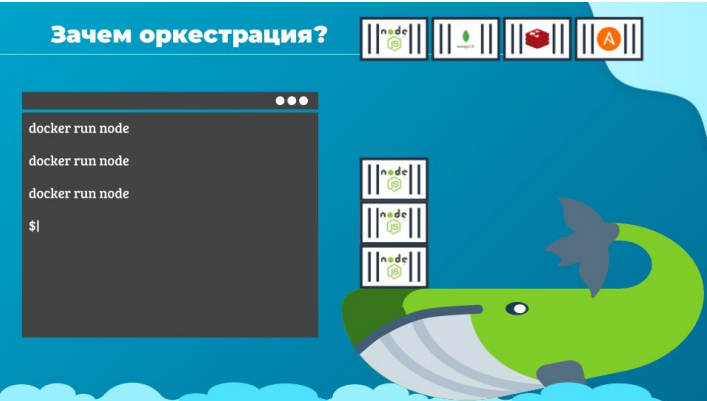
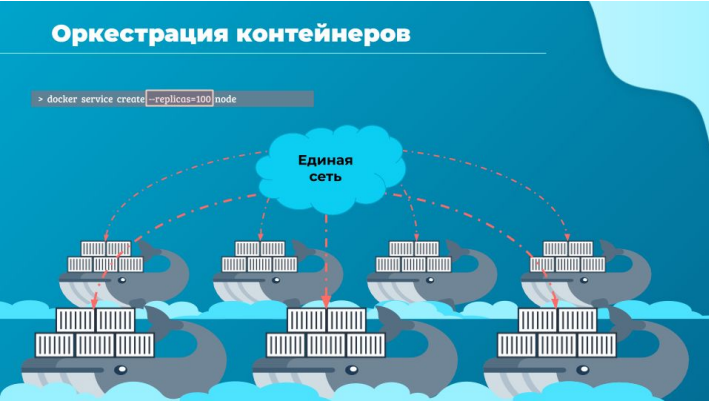
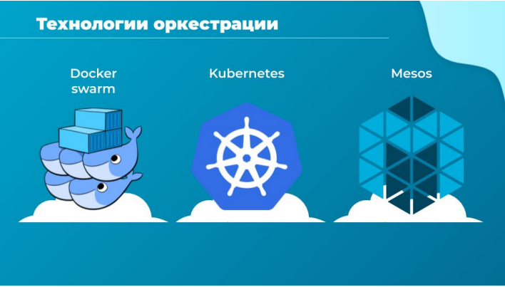

# Оркестрация

Привет и добро пожаловать на лекцию по оркестрации контейнеров. Здесь мы поговорим о том,
как быть, если одного докер-хоста по каким-то причинам недостаточно для разворачивания
проекта, с какими трудностями сталкиваются и как их преодолевают.

Ранее в курсе мы видели, как запустить отдельный экземпляр приложения с помощью Docker.
Для этого мы использовали простую команду `docker run`. В этом случае мы запускаем приложение
на базе node js с помощью команды docker run node. Но это всего один экземпляр на одном
докер-хосте. Что будет, если количество пользователей возрастет настолько, что у запущенного
инстанса не станет хватать ресурсов, чтобы справиться с нагрузкой?

Ты можешь развернуть дополнительный экземпляр своего приложения с помощью такой же
команды `docker run` и повторить это несколько раз. Т.е. тебе придется самому следить за
нагрузкой и производительностью приложения, соответственно реагировать запуская или
останавливая дополнительные копии приложения. А если контейнер выйдет из строя, тебе нужно
это обнаружить и снова запустить команду docker run, чтобы развернуть другой экземпляр
приложения.

А что с докер-хостом? Надо знать как он себя чувствует, мониторить его ресурсы. Что если хост
упадет и станет недоступным? В этом случае все наше приложение перестанет отвечать
пользователям.

Если мы начнем решать все эти проблемы самостоятельно, то потребуется минимум отдельный
инженер, который будет заниматься мониторингом состояний производительности и здоровья
контейнеров и хоста и, при необходимости, исправлять ситуацию. Если твое приложение
действительно большое, скажем от тысячи контейнеров, такой подход совершенно неприменим.

Разумеется можно начать самому автоматизировать эти процессы, написав какие-то скрипты. И
это будет как-то работать. Проблемы начнуться очень скоро, когда:

- поменяются сотрудники - новых придется переучивать,
- ротируются разработчики, у других может быть свой взгляд на автоматизацию,
- постоянно появляются новые технологии, которые требуют новых интеграций,
- появятся вызовы безопасности, которые вскроют все проблемы непродуманной
  архитектуры или каких-то временных компромиссов, сделанных для упрощения в прошлом.

Решения по оркестрации контейнеров помогут нам в этом случае. Эти решения содержат в себе
набор подходов, технологий и инструментов, которые обслуживают контейнерные нагрузки в
продакшене. Как правило, подобное решение реализует в себе несколько докер-хостов, чтобы в
случае неисправности одного из них работа не останавливалась, и пользователь не замечал
простоя.

В случае проблем, система оркестрации сама переключит пользователя на другой докер-хост и
попробует вернуть в строй неисправный. Также эти решения для оркестрации позволяет легко
развернуть сотни или тысячи экземпляров приложения с помощью одной команды.

Эта команда используется в Docker swarm. Мы ее немного рассмотрим в следующей лекции.

Некоторые решения для оркестрации могут помочь нам автоматически увеличить количество
экземпляров при увеличении количества пользователей, и уменьшить количество экземпляров при
уменьшении спроса. Часть решений могут даже помочь нам в автоматическом добавлении
дополнительных хостов для поддержки пользовательской нагрузки, а не только в кластеризации и
масштабировании количества контейнеров.

Также они обеспечивают поддержку специальной сети между этими контейнерами на разных
хостах, и обслуживают балансировку нагрузки пользовательских запросов между разными
докер-хостами. Из этих решений можно осуществлять управление конфигурацией и безопасностью
в кластере и обеспечивать совместное использование хранилища между хостами.

Сегодня доступно несколько систем для оркестрации контейнеров. У Docker это решение Docker
Swarm, Kubernetes от Google и MESOS от Apache.

По сравнению с другими, Docker Swarm очень легко настроить и начать пользоваться, это хорошее
решение для начала. Но с другой стороны в нем не хватает многих нужных функций, которые
требуются для сложных приложений.

В случае с MESOS его намного сложнее установить и настроить, но он предлагает много
продвинутого функционала.

Kubernetes из этих трех самый популярный:

- он не такой сложный в настройке, с ним можно быстро начать работу.
- он дает большое количество вариантов развертывания и поддерживает сложные
  архитектуры

Kubernetes в данный момент поддерживается всеми клауд-вендорами, такими как GCP, Azure, AWS,
Alibaba, а проект Kubernetes один из популярнейших на гитхаб.
