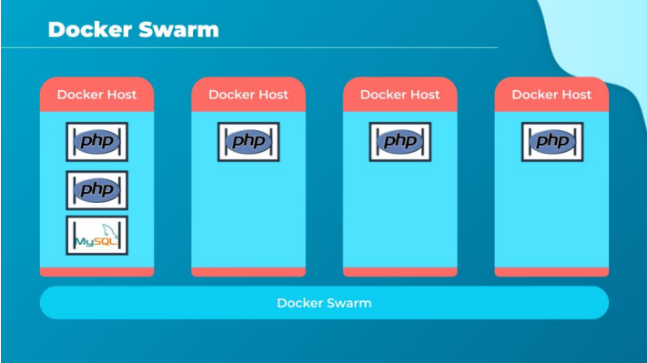
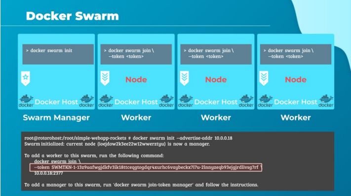
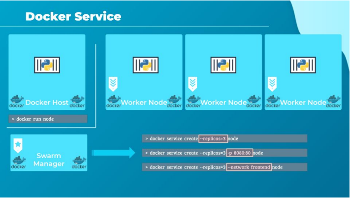

# Docker Swarm

Привет, в этой небольшой лекции я немного познакомлю тебя с Docker Swarm. Docker Swarm
включает в себя много концепции и потребует своего собственного курса. Здесь я покажу
основные детали, как говориться "в крупную клетку". После этого ты будешь понимать о чем речь,
и, когда тебе понадобиться эта технология будешь знать, куда смотреть.

С Docker Swarm ты можешь собрать несколько докер-хостов в единый кластер, который будет
согласованно работать над твоими задачами. Кластер займется распределением служб или
экземпляров приложений на отдельные хосты, тем самым обеспечит высокую доступность и
балансировку нагрузки между различными системами и оборудованием.

Для начала тебе потребуется одна или несколько машин с установленным на них Docker. После
этого нужно определиться, какой из этих хостов будет использоваться в роли менеджера или
мастера. Остальные хосты станут слейвами или воркерами.

Затем запустим команду `docker swarm init` на менеджере для инициализации менеджера swarm.

В выводе команды будет представлена команда, которую нужно запустить на воркерах, для того,
чтобы рабочие экземпляры swarm смогли присоединиться к менеджеру в кластере. После
присоединения к swarm рабочие хосты станут называться нодами, и теперь мы готовы создавать
службы и развертывать их в кластере swarm.

Давай рассмотрим некоторые подробности. Как ты помнишь ранее, чтобы запустить экземпляр
моего веб-сервера мне требовалось запустить команду `docker run` и указать имя образа, который
я хотел запустить. Это создаст новый контейнер с экземпляром моего приложения и в нем мой
сервер начнет обслуживать клиентов.

Мы уже узнали, как создать кластер swarm. А как использовать кластер для запуска нескольких
экземпляров моего веб-сервера?

Один из способов добиться этого - запустить команду `docker run` на каждой воркер ноде кластера.
В случае пары узлов это звучит приемлемо, но если нод сотни?

Т.е. мне придется придется входить на каждую из сотни нод и запускать эту команду, для этого
мне нужно будет где-то держать все учетные записи или ключи для входа. Также мне придется
придумать решение для балансировки нагрузки, а для этого мне потребуется также решить вопрос
с мониторингом состояния узла в части его загруженности. И еще мне потребуется проверять, как
чувствует себя контейнер, и живо ли мое приложение в нем, а там где произойдет сбой, мне нужно
будет перезапустить контейнер самостоятельно.

Такая миссия очень быстро становится невыполнимой. Процессы можно улучшить самодельной
автоматизацией, но ее приходится поддерживать и со временем это превращается в уродливого
монстра. И именно здесь оркестрация Docker swarm решит эти задачи за нас.

Пока мы только создали этот кластер, но не видели оркестрацию в действии. Ключевым
компонентом оркестрации swarm является service. Service в Docker - это один или несколько
экземпляров одного приложения или службы, которые работают на нодах в кластере.

Например, я создам Docker service чтобы запустить несколько экземпляров моего веб-сервера на
нескольких нодах в моем swarm кластере. Для этого запущу команду `docker service create` на
менеджере swarm. Я укажу имя моего образа в этой команде. А использовав параметр --replicas
задам количество экземпляров этого приложения, которые мне нужно развернуть в моем
кластере.

Поскольку я указал три реплики, я получу три экземпляра моего веб-сервера, распределенных по
разным рабочим узлам.

Помни, что команда `docker service` должна запускаться на ноде-менеджере, а не на рабочем узле.
Команда `docker service create` аналогична команде `docker run` в случае отдельного докер-хоста.
То же самое и в отношении уже знакомых параметров, таких как -e (переменные окружения),
параметра -p для публикации портов, опции --network для подключения контейнера к сети и т. д.
