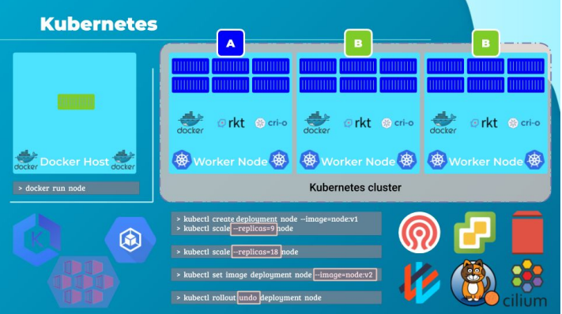
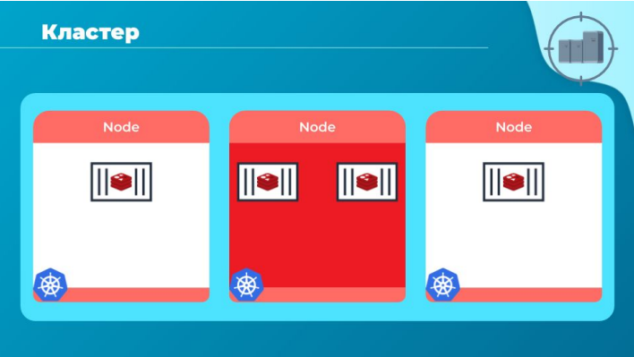
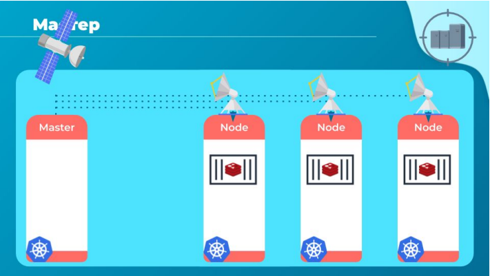
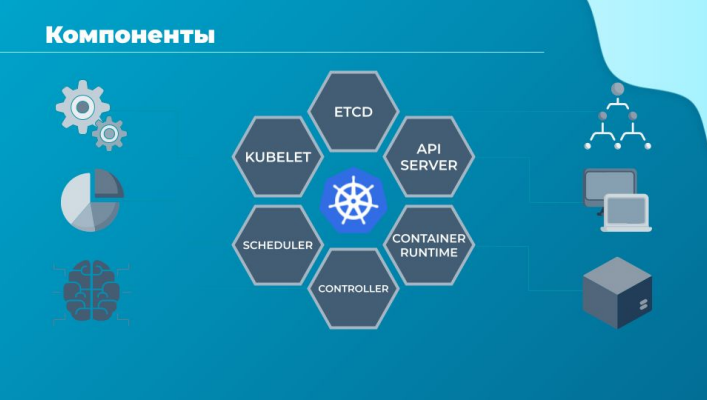
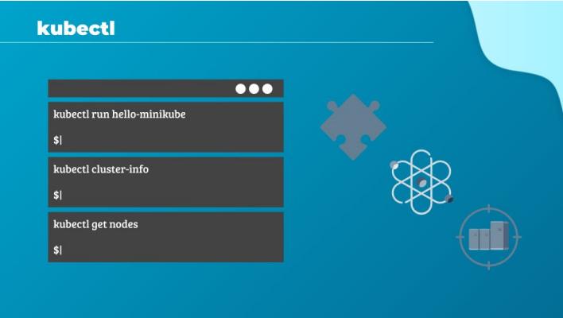

# Kubernetes

Привет, в этой лекции мы делаем краткое введение в базовые концепции Kubernetes. Kubernetes
требует своего собственного курса, даже не одного, а целых четырех. Сейчас мы постараемся
кратко познакомиться с ним, на том уровне, чтобы не пугаться при беседе о Kubernetes.

Итак, с помощью Docker мы смогли запустить один экземпляр приложения, введя в докер-cli
команду `docker run`, которая запустила контейнер. И теперь наша жизнь изменилась, ведь прежде
развертывание приложений никогда не было таким простым.

С Kubernetes, использующим Kubernetes-cli, известный как утилита управления kube control, мы
можем запустить нужное нам количество экземпляров одного и того же приложения с помощью
всего одной команды.

Kubernetes может легко отмасштабировать количество реплик приложения до нужных нам
значений с помощью другой команды.

Kubernetes можно даже настроить на автоматическое выполнение этой операции, чтобы
экземпляры и сама инфраструктура могли масштабироваться вверх и вниз, в зависимости от
пользовательской нагрузки.

Kubernetes может обновлять тысячи экземпляров приложения в режиме последовательного
обновления по одному, группами или все разом с помощью всего одной команды.

Если что-то пойдет не так, он может откатить все эти развертывания с помощью одной команды и
вернуться на предыдущую рабочую версию.

Kubernetes может помочь нам устроить A-B тесты для новых фич нашего приложения, обновив
только нужный процент экземпляров, благодаря возможности указания количества реплик для
каждой версии.

Открытая архитектура Kubernetes обеспечивает поддержку множества различных сетей и
хранилищ. Любая торговая марка сетей или хранилища, о которой ты можешь подумать, имеет
плагин для Kubernetes. Kubernetes поддерживает различные механизмы аутентификации и
авторизации. Все основные поставщики облачных сервисов имеют встроенную поддержку
Kubernetes.

Итак, какова связь между Docker и Kubernetes? Kubernetes использует докер-хосты для
размещения приложений в виде контейнеров Docker. Но это не обязательно должен быть Docker
все время, Kubernetes поддерживает в качестве альтернативы Dockers, например, Rkt или Cri-o. Но
по факту на rkt редко где встретишь, и этот проект более не развивается. Так что в реальном мире
это или Docker, или Cri-o. И последний завоевывает позиции. Т.к. Docker многофункциональный
инструмент, он не очень хорошо вписывается в роль только среды для запуска контейнеров,
которую в нем видит Kubernetes. Cri-o, в свою очередь, имеет более оптимизированный и
легковесный инструмент для запуска контейнеров и продвинутые возможностями для их
траблешутинга.

В момент написания статьи уже объявлено, что Kubernetes перестанет поддерживать Docker в
качестве container runtime. Это не значит, что эра докер-контейнеров прошла, они как раз
остануться, но похоже, что самого докера в Kubernetes со временем не останется.

Давай вернемся к основной теме и кратко рассмотрим архитектуру Kubernetes.
Кластер представляет из себя набор узлов - nodes.

Нода это машина, физическая или виртуальная, на которой установлен Kubernetes. Воркер нода, это
узел, на котором Kubernetes будет запускать контейнеры с полезной нагрузкой. Раньше они
назывались миньонами. Услышав этот термин имей в виду, что это синонимы. Что случится, если
нода выйдет из строя?

Очевидно, что наше приложение упадет. Выходит, нам нужно иметь больше одной ноды. Кластер -
это набор сгруппированных вместе узлов. Таким образом, даже если один узел падает, наше
приложение по-прежнему доступно для пользователей. Более того, наличие нескольких нод также
помогает в распределении нагрузки.

Ок, теперь у нас есть кластер, но кто будет отвечать за его управление? Где будет храниться
информация о членах кластера? Как нам узнать о событиях, происходящих на нодах? А когда нода
выйдет из строя, как перенести рабочую нагрузку с упавшей ноды на исправную?

Вот здесь появляется мастер, или как теперь его политкорректно называют controlplane. Мастер
это еще одна нода, член кластера Kubernetes, сконфигурированная как мастер. У нее особые
функции: наблюдать за состоянием других нод и быть ответственной за оркестрацию контейнеров
на воркер-нодах.

Когда ты устанавливаешь Kubernetes в систему, ты фактически устанавливаешь следующие
компоненты:

- API сервер
- Контейнер рантайм
- контроллеры и скедулеры
- службу kubelet
- службу ETCD

API сервер выступает в качестве фронтенда, единого интерфейса для Kubernetes. Пользователи,
устройства управления, интерфейсы командной строки, все общаются с API сервером для
взаимодействия с кластером.

Среда выполнения контейнеров или контейнер-рантайм - это базовое программное обеспечение,
которое используется для запуска контейнеров. В нашем случае это Docker, но есть и другие
варианты.

Контроллеры - это мозг оркестрации. Они смотрят за состоянием нод, контейнеров, эндпоинтов и
ответственны за реакцию на события на нодах. Контроллеры принимают решения о создании
новых контейнеров.

Скедулер ответственен за распределение работ или контейнеров между нодами. Он ожидает, когда
в системе появится новый контейнер, чтобы назначить его выполнение на ноду.

Далее kubelet - это агент, который работает на каждом узле кластера. Агент отвечает за то, чтобы
контейнеры работали на узлах должным образом.

И, наконец, ETCD - хранилище "ключ-значение". ETCD - это распределенная, надежная база данных,
используемая Kubernetes для хранения всей информации нужной для управления кластером.

И в конце нам нужно немного узнать об утилите командной строки kubectl или kube control, как ее
еще называют. Инструмент kubectl используется для развертывания и управления приложениями в
кластере Kubernetes, для получения информации о кластере, получения состояния других нод в
кластере и управления другими вещами.

Команда `kubectl run` используется для развертывания приложения в кластере.

Команда `kubectl cluster-info` используется для просмотра информации о кластере.

Команда `kubectl get nodes` используется для вывода списка всех узлов в кластере.

Как я говорил, это мощный инструмент и одной командой можно внести изменения в тысячи копий
приложения на сотнях узлов.

