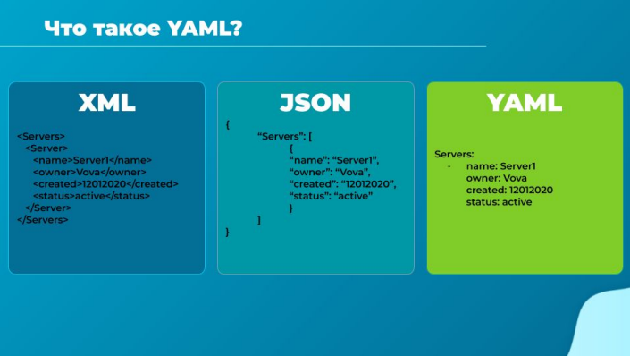
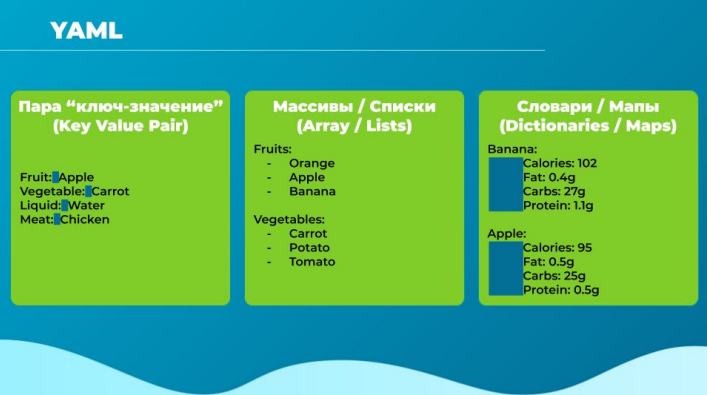
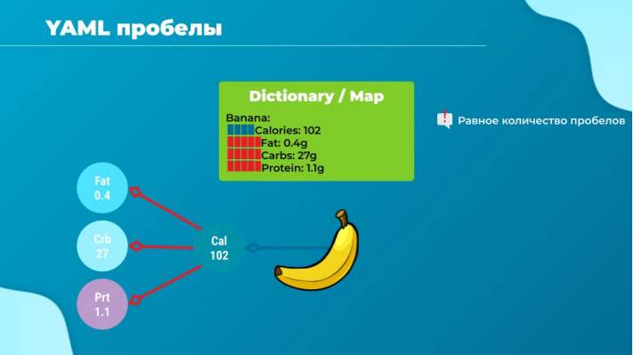
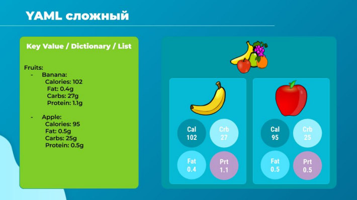
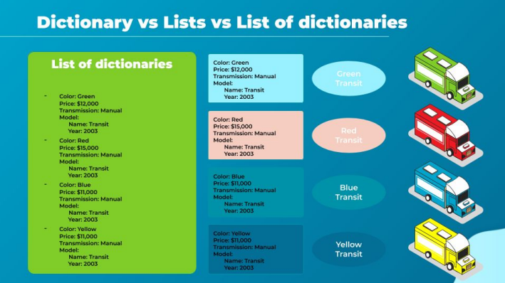
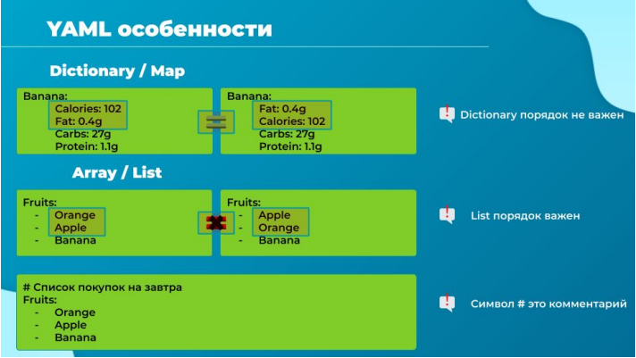

# Введение в YAML

Привет и добро пожаловать на лекцию, где мы узнаем, что такое YAML файлы. Если ты знаком с
YAML файлами, просто пропусти этот раздел. Но если ты не еще работал с YAML до этого времени,
я сильно рекомендую тебе внимательно пройти эту лекцию и упражнения, потому что многое в
курсе зависит от знания YAML. Если ты работал с другими форматами структурирования данных,
такими как XML или JSON, ты легко все поймешь. Не волнуйся, если ты не работал ни с одним из
них. Тытакже все легко поймешь, проработав навык в упражнениях, которые сопровождают курс.
YAML файл используется для представления данных, в нашем случае для файлов конфигурации.

Здесь быстрое сравнение образцов одинаковых данных в трех разных форматах. Левый это XML,
где мы представили список серверов и информацию о них. Те же данные представлены в JSON
формате посередине. И, наконец, YAML формат справа. Посмотри внимательно на форматы и
сравни их.

Давай взглянем ближе на YAML. Если взять данные в простейшей форме вроде "ключ-значение",
вот как это выглядит в YAML. Ключ и значение разделено двоеточием. Ключи это: fruit, vegetable,
liquid, и meat. Значения: apple, carrot, water, и chicken. Запомни, после двоеточия должен идти
пробел, который разделит ключ и значение.

Теперь посмотрим, как представлен массив. Мы хотели бы перечислить несколько фруктов и
овощей. Напишем fruits, за которым следует двоеточие. Далее в каждый элемент массива
напишем с новой строки с тире впереди. Тире обозначает, что это элемент массива.

Что насчет ассоциативных массивов? Dictionary это набор свойств, сгруппированный вместе под
одним элементом. Здесь мы попробуем представить пищевую ценность двух фруктов. Калории,
жир, углеводы и белки отдельно для каждого фрукта. Обрати внимание на пустое место перед
каждым элементом dictionary. Перед свойствами отдельного элемента должно быть равное
количество пробелов, чтобы у них было одинаковое выравнивание.

Теперь взглянем внимательнее на пробелы в YAML. Здесь у нас dictionary, представляющий
пищевую ценность банана. Показаны общее количество калорий, жира, углеводов и белка. Обрати
внимание, количество пробелов перед каждым элементом определяет, что эти пары
"ключ-значение" относятся к банану. Что произойдет, если добавить дополнительные пробелы для
fat, carbs и protein?

Они попадут в категорию калорий, т.е. станут свойствами калорий, в чем нет никакого смысла. Еще
это приведет к синтаксической ошибке, которая сообщит, что сопоставление значений здесь
недопустимо, поскольку у ключа calories есть уже значение 102. Ты можешь присвоить ключу -
значение, или установить его как название для низлежащего объекта, но только что-то одно.
Количество пробелов перед каждым свойством является ключевым в YAML. Убедись в
правильности расстановки пробелов, чтобы данные были представлены как предполагалось.

Усложним задачу. Давай создадим list, содержащий dictionaries. В этом случае у нас есть list
фруктов - fruits. Его элементы банан и яблоко. Каждый из этих элементов представляет из себя
dictionary, в котором содержится пищевая ценность.

Большинство новичков в YAML задают мне вопрос: что лучше использовать dictionary или list?
Попробую объяснить по-понятнее. Во первых, и это важно понять, то, о чем мы говорим далеко от
XML, JSON, или YAML, которые используются для представления данных. У нас могут быть данные
организации и всех их сотрудников с персональными деталями, или данные школы со всеми ее
студентами, их отметками, или данные автопроизводителя о выпущенных машинах и их деталях.
Все что угодно.

Возьмем для примера автомобильный фургон. Машина это отдельный объект. Ее свойства это:
цвет, цена, трансмиссия и модель. Для хранения разной информации или свойств объекта мы
используем dictionary. В этом простом dictionary свойства машины представлены в формате
"ключ-значение".

Все может стать сложнее, например нам нужно разделить свойство model на название модели и
год выпуска. Это можно представить как dictionary внутри другого dictionary. Тогда значение поля
model заменится небольшим dictionary с двумя свойствами name и year. Это dictionary в другом
dictionary.

Теперь поговорим, как хранить имена четырех машин. Имена сформированы из цвета и модели
фургона. Для хранения этого мы будем использовать list или array, т.к. у нас много элементов
одного и того же вида. Мы храним только имена, и это простой массив строк.

Т.е. если информация однотипная, хорошо подойдет list, а если разнородная - dictionary.

А что, если мы захотим сохранить всю информацию о каждой машине? Все, что мы перечисляли
раньше: цвет, цену, трансмиссию и модель. Нам нужно будет изменить list of strings на list of
dictionaries. Мы расширяем каждый элемент в list и меняем имя на созданный ранее dictionary.

Таким образом, у нас получилось представить всю информацию о множестве фургонов в одном
YAML файле используя list of dictionaries. В этом различие между list и list of dictionaries.

Надеюсь, различия стали очевидны и тебе стало проще понимать, когда какие использовать.

Перед началом упражнений давай примем во внимание пару особенностей формата. Dictionary - это
коллекция не требовательная к порядку элементов, в отличие от list, которые порядок соблюдают.

Что это значит? Два dictionaries представленных здесь имеют одинаковые свойства для banana, но
порядок свойств не совпадает. В первом fat идет после calories, а во втором наоборот.

В случае dictionary это не имеет значения, свойства могут быть определены в любом порядке. Два
dictionaries будут считаться идентичными, пока все значения всех их свойств совпадают.

Это не относится к массивам. Lists - упорядоченные коллекции, здесь порядок элементов имеет
значение. В этом случае два lists не одинаковые, потому что яблоко и апельсин на разных позициях.
Не забудь об этом, когда будешь работать со структурами данных

Еще момент, любая строка начинающаяся с символа ХЭШ (#) будет автоматически
проигнорирована парсером, она рассматривается как комментарий.
